# 📊 DIAGRAMMA PERIODIZZAZIONE 6 MESI
## VERSIONE BILANCIATA: Tonificazione + Performance

## Panoramica Visuale del Programma

### Timeline Completa

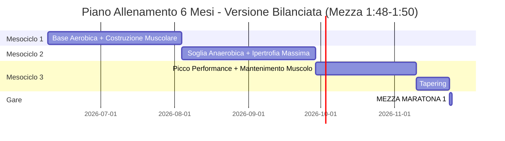

---

## Progressione Volume Corsa (RIDOTTO per Tonificazione)

```mermaid
graph LR
    A[Settimane 1-4<br/>34-38 km<br/>Lungo MAX 18km] --> B[Settimane 5-8<br/>38-42 km<br/>Lungo MAX 20km]
    B --> C[Settimane 9-12<br/>38-42 km<br/>Lungo MAX 20km]
    C --> D[Settimane 13-16<br/>40-44 km<br/>Lungo MAX 22km]
    D --> E[Settimane 17-20<br/>40-44 km<br/>Lungo MAX 22km]
    E --> F[Settimane 21-22<br/>40-42 km<br/>Lungo MAX 20km]
    F --> G[Settimane 23-24<br/>30-35 km<br/>TAPERING]
    G --> H[GARA<br/>21.1 km<br/>1:48-1:50]
    
    style A fill:#90EE90
    style B fill:#90EE90
    style C fill:#FFD700
    style D fill:#FFD700
    style E fill:#FF6B6B
    style F fill:#FF6B6B
    style G fill:#87CEEB
    style H fill:#FF1493
```

---

## Struttura Settimanale

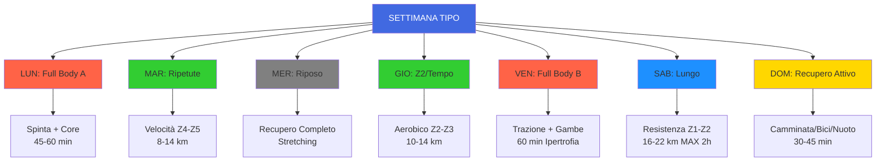

---

## Progressione Intensità Ripetute

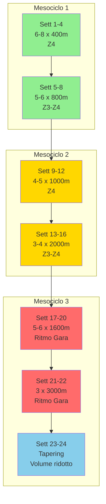

---

## Progressione Forza

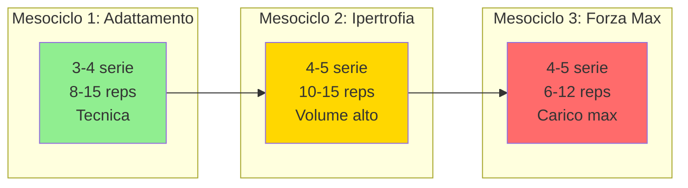

---

## Obiettivi per Mesociclo

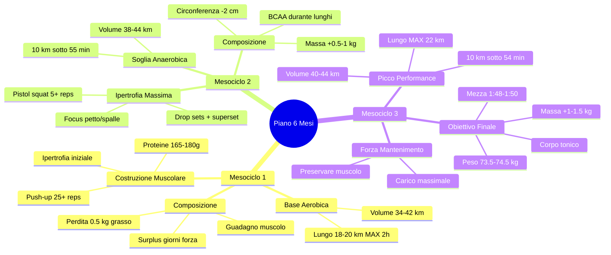

---

## Ciclizzazione Calorica Settimanale

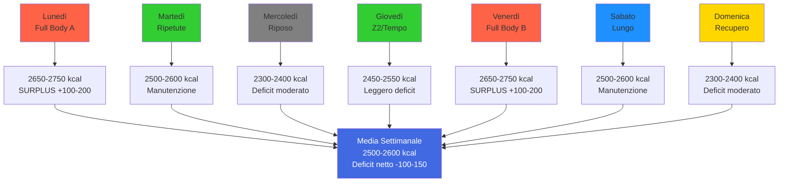

---

## Flusso Decisionale Recupero

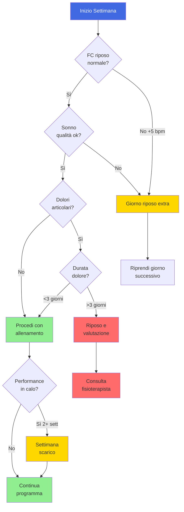

---

## Timeline Test Valutazione

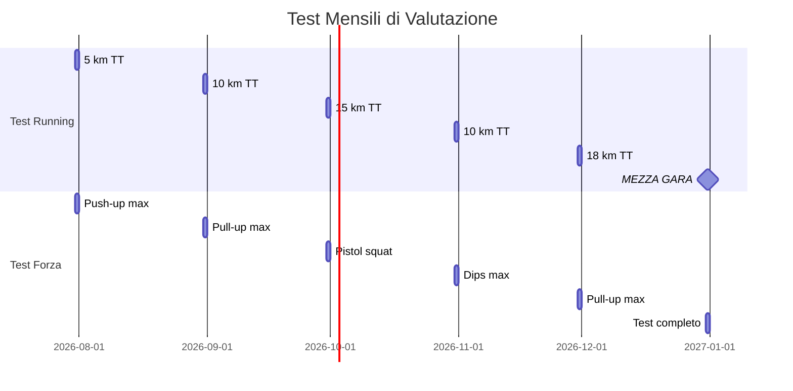

---

## Progressione Lungo Sabato

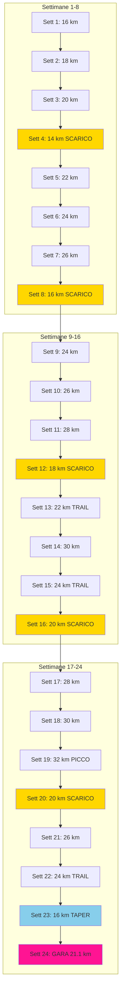

---

## Legenda Colori

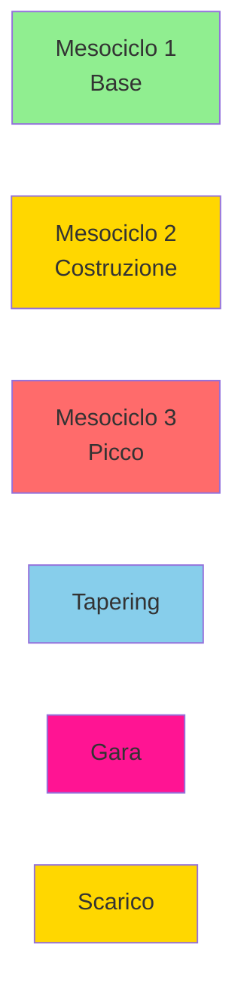

**Verde:** Fase base/adattamento  
**Giallo:** Fase costruzione/ipertrofia  
**Rosso:** Fase picco/intensità massima  
**Azzurro:** Tapering pre-gara  
**Rosa:** Gara obiettivo  
**Giallo scuro:** Settimane scarico

---

## Note sui Diagrammi

Questi diagrammi visualizzano:

1. **Timeline generale:** Panoramica dei 3 mesocicli e progressione temporale
2. **Volume corsa:** Aumento graduale del chilometraggio settimanale
3. **Struttura settimanale:** Distribuzione allenamenti nei 7 giorni
4. **Progressione ripetute:** Evoluzione da 400m a 3000m
5. **Progressione forza:** Da adattamento a forza massima
6. **Obiettivi mesociclo:** Traguardi intermedi per ogni fase
7. **Ciclizzazione calorica:** Gestione calorie durante la settimana
8. **Flusso recupero:** Processo decisionale per gestire affaticamento
9. **Test valutazione:** Calendario test mensili
10. **Progressione lungo:** Evoluzione corsa lunga del sabato

Usa questi diagrammi come riferimento visivo rapido per comprendere la struttura e progressione del programma.

---

*Per dettagli completi, consulta: [`Piano_Allenamento_6_Mesi.md`](Piano_Allenamento_6_Mesi.md)*