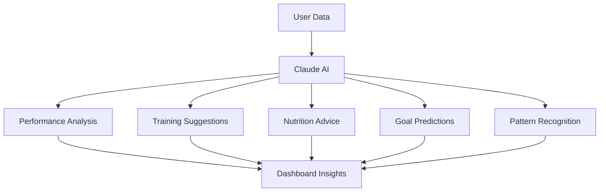
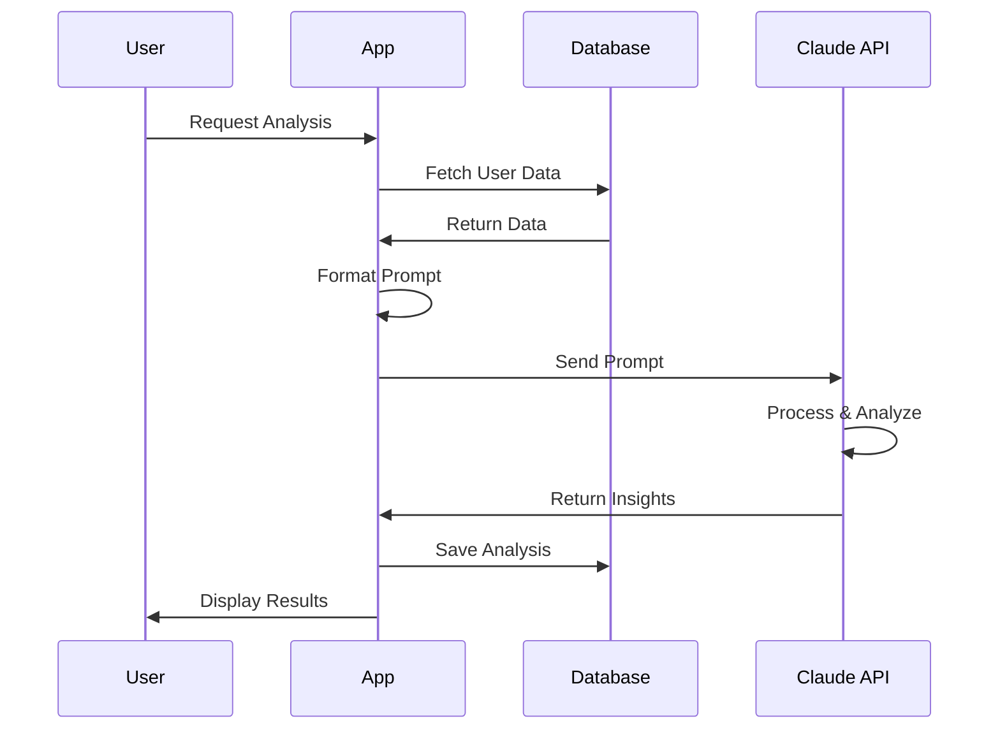

# 🤖 Integrazione Claude AI per Analisi Fitness

## 📋 Indice

1. [Panoramica](#panoramica)
2. [Setup Anthropic API](#setup-anthropic-api)
3. [Architettura Integrazione](#architettura-integrazione)
4. [Prompt Engineering](#prompt-engineering)
5. [Implementazione Bubble.io](#implementazione-bubbleio)
6. [Implementazione Softr](#implementazione-softr)
7. [Casi d'Uso](#casi-duso)
8. [Ottimizzazione Costi](#ottimizzazione-costi)
9. [Best Practices](#best-practices)
10. [Testing](#testing)

---

## 1. Panoramica

### 1.1 Cos'è Claude AI

Claude è un assistente AI sviluppato da Anthropic, capace di:
- Analizzare dati complessi
- Fornire insights personalizzati
- Generare consigli basati su pattern
- Rispondere a domande in linguaggio naturale

### 1.2 Utilizzi nel Fitness Tracker



**Funzionalità Principali:**
1. **Analisi Performance**: Trend, progressi, aree di miglioramento
2. **Suggerimenti Allenamento**: Piani personalizzati, recupero
3. **Consigli Nutrizionali**: Bilanciamento macros, timing
4. **Previsioni Obiettivi**: Stima raggiungimento target
5. **Identificazione Pattern**: Correlazioni tra variabili

### 1.3 Vantaggi vs Limitazioni

**Vantaggi:**
- ✅ Analisi contestuale avanzata
- ✅ Linguaggio naturale
- ✅ Personalizzazione profonda
- ✅ Apprendimento continuo
- ✅ Multilingua (italiano supportato)

**Limitazioni:**
- ❌ Costo per token
- ❌ Latenza (2-5 secondi)
- ❌ Rate limits
- ❌ Richiede dati strutturati
- ❌ Non sostituisce professionisti

---

## 2. Setup Anthropic API

### 2.1 Creazione Account

**Step 1: Registrazione**
```
1. Vai su https://console.anthropic.com
2. Sign up con email
3. Verifica email
4. Completa profilo
```

**Step 2: Ottenere API Key**
```
1. Dashboard → API Keys
2. Click "Create Key"
3. Nome: "Fitness Tracker Production"
4. Copia API Key
5. Salva in luogo sicuro (NON committare!)
```

**Step 3: Setup Billing**
```
1. Settings → Billing
2. Aggiungi metodo pagamento
3. Imposta budget alert (es. $50/mese)
4. Abilita auto-reload (opzionale)
```

### 2.2 Pricing

**Claude 3.5 Sonnet (Consigliato):**
```
Input: $3 per 1M tokens
Output: $15 per 1M tokens

Esempio costi:
- Analisi semplice (500 tokens in, 200 out): $0.004
- Analisi completa (2000 tokens in, 800 out): $0.018
- 100 analisi/mese: ~$1.80
```

**Claude 3 Haiku (Economico):**
```
Input: $0.25 per 1M tokens
Output: $1.25 per 1M tokens

Esempio costi:
- Analisi semplice: $0.0004
- 100 analisi/mese: ~$0.15
```

### 2.3 Rate Limits

**Piano Free:**
```
- 50 requests/day
- 5 requests/minute
- Max 4096 tokens per request
```

**Piano Pay-as-you-go:**
```
- 1000 requests/day
- 50 requests/minute
- Max 200k tokens per request
```

---

## 3. Architettura Integrazione

### 3.1 Flusso Dati



### 3.2 Componenti

```
1. Data Collector
   - Raccoglie dati utente
   - Filtra per rilevanza
   - Formatta per Claude

2. Prompt Builder
   - Costruisce prompt strutturato
   - Include contesto
   - Definisce output format

3. API Client
   - Gestisce chiamate API
   - Handle errors
   - Retry logic

4. Response Parser
   - Estrae insights
   - Formatta per UI
   - Salva in database

5. Cache Layer
   - Cache analisi recenti
   - Riduce costi
   - Migliora performance
```

### 3.3 Tipi di Analisi

```javascript
const analysisTypes = {
  QUICK_INSIGHT: {
    frequency: "on_demand",
    data_range: "7_days",
    cost: "low",
    response_time: "2s"
  },
  
  WEEKLY_SUMMARY: {
    frequency: "weekly",
    data_range: "7_days",
    cost: "medium",
    response_time: "5s"
  },
  
  MONTHLY_REPORT: {
    frequency: "monthly",
    data_range: "30_days",
    cost: "high",
    response_time: "10s"
  },
  
  GOAL_PREDICTION: {
    frequency: "on_demand",
    data_range: "90_days",
    cost: "medium",
    response_time: "5s"
  }
};
```

---

## 4. Prompt Engineering

### 4.1 Struttura Prompt Base

```
System Prompt:
Sei un esperto coach di fitness e nutrizione. Analizza i dati dell'utente 
e fornisci insights personalizzati, consigli pratici e motivazione. 
Rispondi sempre in italiano, in modo chiaro e conciso.

User Prompt:
[CONTESTO UTENTE]
[DATI ATTIVITÀ]
[OBIETTIVI]
[DOMANDA/RICHIESTA]

Output Format:
[FORMATO STRUTTURATO]
```

### 4.2 Template Analisi Performance

```javascript
const performanceAnalysisPrompt = `
Sei un coach di running esperto. Analizza le performance di corsa dell'utente.

PROFILO UTENTE:
- Nome: ${user.name}
- Età: ${user.age} anni
- Obiettivo: ${user.goal}

DATI ULTIMI 30 GIORNI:
- Corse totali: ${stats.total_runs}
- Distanza totale: ${stats.total_distance} km
- Passo medio: ${stats.avg_pace} min/km
- FC media: ${stats.avg_hr} bpm
- Trend passo: ${stats.pace_trend}

ATTIVITÀ RECENTI:
${recentActivities.map(a => `
- ${a.date}: ${a.distance}km in ${a.duration}, passo ${a.pace}, FC ${a.hr}
`).join('\n')}

ANALIZZA:
1. Progressione generale (miglioramento/peggioramento)
2. Punti di forza
3. Aree di miglioramento
4. Consigli specifici per prossimi allenamenti
5. Rischio infortuni o sovrallenamento

FORMATO RISPOSTA (JSON):
{
  "overall_score": 1-10,
  "trend": "improving|stable|declining",
  "strengths": ["punto 1", "punto 2"],
  "improvements": ["area 1", "area 2"],
  "suggestions": ["consiglio 1", "consiglio 2"],
  "warnings": ["avviso 1"] o [],
  "motivation": "messaggio motivazionale"
}
`;
```

### 4.3 Template Consigli Allenamento

```javascript
const trainingAdvicePrompt = `
Sei un personal trainer esperto. Suggerisci il prossimo allenamento.

PROFILO:
- Livello: ${user.level}
- Obiettivo: ${user.goal}
- Giorni allenamento/settimana: ${user.training_days}

ULTIMA SETTIMANA:
${lastWeekWorkouts.map(w => `
- ${w.date}: ${w.type}, ${w.exercises.length} esercizi, RPE ${w.rpe}
`).join('\n')}

STATO ATTUALE:
- Giorni dall'ultimo workout: ${daysSinceLastWorkout}
- Volume settimana corrente: ${currentWeekVolume} kg
- RPE medio settimana: ${avgRPE}

SUGGERISCI:
1. Tipo workout consigliato (PUSH/PULL/LEGS)
2. Intensità (RPE target)
3. 4-6 esercizi specifici con serie/reps
4. Note su recupero e progressione

FORMATO RISPOSTA (JSON):
{
  "workout_type": "PUSH|PULL|LEGS",
  "target_rpe": 7-9,
  "exercises": [
    {
      "name": "nome esercizio",
      "sets": 3-5,
      "reps": "8-12",
      "notes": "note esecuzione"
    }
  ],
  "duration_estimate": "60-90 min",
  "recovery_notes": "consigli recupero"
}
`;
```

### 4.4 Template Analisi Nutrizionale

```javascript
const nutritionAnalysisPrompt = `
Sei un nutrizionista sportivo. Analizza l'alimentazione dell'utente.

PROFILO:
- Peso attuale: ${user.weight} kg
- Peso obiettivo: ${user.target_weight} kg
- Obiettivo calorico: ${user.calorie_target} kcal/giorno
- Macros target: ${user.protein}P / ${user.carbs}C / ${user.fats}F

ULTIMI 7 GIORNI:
${last7Days.map(d => `
- ${d.date}: ${d.calories} kcal (${d.protein}P/${d.carbs}C/${d.fats}F)
`).join('\n')}

STATISTICHE:
- Calorie medie: ${stats.avg_calories} kcal/giorno
- Aderenza obiettivo: ${stats.adherence}%
- Trend peso: ${stats.weight_trend}

ANALIZZA:
1. Aderenza agli obiettivi
2. Bilanciamento macronutrienti
3. Pattern alimentari (es. weekend vs weekday)
4. Suggerimenti miglioramento
5. Timing nutrizione rispetto allenamenti

FORMATO RISPOSTA (JSON):
{
  "adherence_score": 1-10,
  "macro_balance": "optimal|good|needs_adjustment",
  "insights": ["insight 1", "insight 2"],
  "suggestions": ["suggerimento 1", "suggerimento 2"],
  "meal_timing_advice": "consigli timing",
  "hydration_note": "nota idratazione"
}
`;
```

### 4.5 Template Previsione Obiettivi

```javascript
const goalPredictionPrompt = `
Sei un data analyst sportivo. Prevedi il raggiungimento degli obiettivi.

OBIETTIVI UTENTE:
${goals.map(g => `
- ${g.type}: ${g.current}/${g.target} (${g.period})
`).join('\n')}

DATI STORICI (90 giorni):
- Progressione media: ${historicalData.avg_progress}
- Varianza: ${historicalData.variance}
- Trend: ${historicalData.trend}

FATTORI CONSIDERATI:
- Costanza allenamenti: ${consistency}%
- Aderenza piano: ${adherence}%
- Stagionalità: ${season}

PREVEDI:
1. Probabilità raggiungimento per ogni obiettivo
2. Tempo stimato (giorni)
3. Fattori critici
4. Raccomandazioni per accelerare

FORMATO RISPOSTA (JSON):
{
  "predictions": [
    {
      "goal": "nome obiettivo",
      "probability": 0-100,
      "estimated_days": numero,
      "confidence": "high|medium|low",
      "critical_factors": ["fattore 1", "fattore 2"],
      "recommendations": ["raccomandazione 1"]
    }
  ],
  "overall_assessment": "valutazione generale"
}
`;
```

---

## 5. Implementazione Bubble.io

### 5.1 API Connector Setup

**Step 1: Aggiungi API**
```
1. Plugins → API Connector → Add another API
2. Nome: Claude AI
3. Authentication: Private key in header
4. Header key: x-api-key
5. Header value: [your API key]
```

**Step 2: Configura Call**
```
Name: Analyze Performance
Use as: Action
Method: POST
URL: https://api.anthropic.com/v1/messages

Headers:
- x-api-key: [your key]
- anthropic-version: 2023-06-01
- content-type: application/json

Body type: JSON
Body:
{
  "model": "claude-3-5-sonnet-20241022",
  "max_tokens": 1024,
  "messages": [
    {
      "role": "user",
      "content": "<prompt>"
    }
  ]
}

Parameters:
- prompt (text, required)
```

### 5.2 Workflow Analisi

**Pagina: running-dashboard**

**Button: "Richiedi Analisi AI"**
```
Workflow:

Step 1: Show loading
  - Set state "analyzing" = yes
  - Show popup "Analisi in corso..."

Step 2: Collect data
  - Do a search for Running_Activity
    * Constraint: user = Current User
    * Constraint: date ≥ Current date - 30 days
  - Calculate statistics:
    * total_runs = count
    * total_distance = sum distance_km
    * avg_pace = average avg_pace
    * avg_hr = average avg_hr

Step 3: Build prompt
  - Set state "prompt" = [formatted prompt with data]

Step 4: Call Claude API
  - Plugin: Claude AI - Analyze Performance
  - prompt = state "prompt"

Step 5: Parse response
  - Extract JSON from response
  - Set state "analysis" = parsed JSON

Step 6: Save to database (optional)
  - Create AI_Analysis
    * user = Current User
    * type = "performance"
    * data = state "analysis"
    * created_at = Current date/time

Step 7: Display results
  - Hide loading popup
  - Show analysis in UI
  - Set state "analyzing" = no
```

### 5.3 Display Results

**Repeating Group: Insights**
```
Data source: state "analysis"'s insights
Type: text

Cell:
- Icon: 💡
- Text: This insight
```

**Repeating Group: Suggestions**
```
Data source: state "analysis"'s suggestions
Type: text

Cell:
- Icon: 🎯
- Text: This suggestion
```

**Text: Motivation**
```
Content: state "analysis"'s motivation
Style: Highlighted, larger font
```

### 5.4 Caching Strategy

**Custom State:**
```
Page: running-dashboard
States:
  - last_analysis (AI_Analysis)
  - last_analysis_date (date)
  - cache_valid (yes/no)
```

**Workflow: Check Cache**
```
When page is loaded:

Step 1: Check if cache valid
  - If last_analysis_date ≥ Current date - 1 day:
    * Set cache_valid = yes
    * Display last_analysis
  - Else:
    * Set cache_valid = no
    * Show "Richiedi Analisi" button

When "Richiedi Analisi" clicked:
  - Only proceed if cache_valid = no
  - Or show "Ultima analisi: X ore fa"
```

---

## 6. Implementazione Softr

### 6.1 Limitazioni Softr

**Problema:**
Softr non supporta chiamate API dirette complesse

**Soluzioni:**

**Opzione A: Zapier/Make (Consigliata)**
```
1. Trigger: Webhook da Softr
2. Action: Format data
3. Action: HTTP request to Claude
4. Action: Parse response
5. Action: Update Airtable
```

**Opzione B: Custom Code Block**
```
1. JavaScript in Softr
2. Fetch API to Claude
3. Display results in page
```

### 6.2 Setup con Make.com

**Scenario: Performance Analysis**

```
Module 1: Webhook
  - Listen for trigger from Softr
  - Receive user_id

Module 2: Airtable - Search Records
  - Table: Running_Activities
  - Filter: user_id = trigger.user_id
  - Filter: date >= 30 days ago
  - Get all matching records

Module 3: Aggregator
  - Calculate statistics
  - total_runs = count
  - total_distance = sum
  - avg_pace = average
  - avg_hr = average

Module 4: Text Aggregator
  - Build prompt with data
  - Use template

Module 5: HTTP - Claude API
  - Method: POST
  - URL: https://api.anthropic.com/v1/messages
  - Headers:
    * x-api-key: [your key]
    * anthropic-version: 2023-06-01
    * content-type: application/json
  - Body: {
      "model": "claude-3-5-sonnet-20241022",
      "max_tokens": 1024,
      "messages": [{"role": "user", "content": "{{prompt}}"}]
    }

Module 6: JSON Parser
  - Parse Claude response
  - Extract insights

Module 7: Airtable - Create Record
  - Table: AI_Analyses
  - Fields:
    * user_id
    * type: "performance"
    * insights: JSON
    * created_at: now

Module 8: Webhook Response
  - Return success + insights
```

### 6.3 Custom Code in Softr

```html
<!-- In Softr Custom Code Block -->

<div id="ai-analysis">
  <button onclick="requestAnalysis()" id="analyze-btn">
    🤖 Richiedi Analisi AI
  </button>
  <div id="loading" style="display:none;">
    Analisi in corso... ⏳
  </div>
  <div id="results" style="display:none;">
    <h3>📊 Analisi Performance</h3>
    <div id="insights"></div>
    <div id="suggestions"></div>
  </div>
</div>

<script>
async function requestAnalysis() {
  const btn = document.getElementById('analyze-btn');
  const loading = document.getElementById('loading');
  const results = document.getElementById('results');
  
  // Show loading
  btn.disabled = true;
  loading.style.display = 'block';
  results.style.display = 'none';
  
  try {
    // Get user data from Softr context
    const userId = window.logged_in_user.id;
    
    // Call Make.com webhook
    const response = await fetch('YOUR_MAKE_WEBHOOK_URL', {
      method: 'POST',
      headers: {'Content-Type': 'application/json'},
      body: JSON.stringify({user_id: userId})
    });
    
    const data = await response.json();
    
    // Display results
    displayResults(data.insights);
    
  } catch (error) {
    alert('Errore durante l\'analisi: ' + error.message);
  } finally {
    btn.disabled = false;
    loading.style.display = 'none';
  }
}

function displayResults(insights) {
  const results = document.getElementById('results');
  const insightsDiv = document.getElementById('insights');
  const suggestionsDiv = document.getElementById('suggestions');
  
  // Clear previous
  insightsDiv.innerHTML = '';
  suggestionsDiv.innerHTML = '';
  
  // Display insights
  insights.strengths.forEach(s => {
    insightsDiv.innerHTML += `<p>✅ ${s}</p>`;
  });
  
  insights.suggestions.forEach(s => {
    suggestionsDiv.innerHTML += `<p>💡 ${s}</p>`;
  });
  
  results.style.display = 'block';
}
</script>

<style>
#ai-analysis {
  padding: 20px;
  background: #f9fafb;
  border-radius: 8px;
}

#analyze-btn {
  background: #2563eb;
  color: white;
  padding: 12px 24px;
  border: none;
  border-radius: 6px;
  cursor: pointer;
  font-size: 16px;
}

#analyze-btn:disabled {
  opacity: 0.5;
  cursor: not-allowed;
}

#results {
  margin-top: 20px;
}

#insights p, #suggestions p {
  padding: 8px;
  margin: 8px 0;
  background: white;
  border-radius: 4px;
}
</style>
```

---

## 7. Casi d'Uso

### 7.1 Analisi Settimanale Automatica

**Trigger:** Ogni lunedì mattina

**Workflow:**
```
1. Per ogni utente attivo:
   - Raccogli dati ultima settimana
   - Genera analisi con Claude
   - Salva in database
   - Invia email con summary

2. Email template:
   Subject: 📊 Il tuo report settimanale
   Body:
   - Highlights settimana
   - Progressi vs obiettivi
   - Consigli per prossima settimana
   - Link a dashboard
```

### 7.2 Suggerimenti Workout On-Demand

**Trigger:** User click "Suggerisci Workout"

**Workflow:**
```
1. Analizza ultimi workout
2. Considera giorni riposo
3. Valuta volume corrente
4. Genera workout personalizzato
5. Mostra in UI con opzione "Inizia Workout"
```

### 7.3 Q&A Personalizzato

**Trigger:** User fa domanda

**Workflow:**
```
1. User input: "Perché il mio passo è peggiorato?"
2. Raccogli dati rilevanti
3. Costruisci prompt con domanda + contesto
4. Claude analizza e risponde
5. Mostra risposta conversazionale
```

### 7.4 Comparazione Periodi

**Trigger:** User seleziona 2 periodi

**Workflow:**
```
1. Raccogli dati periodo A
2. Raccogli dati periodo B
3. Prompt: "Confronta questi due periodi"
4. Claude identifica differenze chiave
5. Mostra comparazione visuale + insights
```

### 7.5 Previsione Gara

**Trigger:** User inserisce gara futura

**Workflow:**
```
1. Dati: distanza gara, data, obiettivo tempo
2. Analizza progressione attuale
3. Calcola passo necessario
4. Valuta fattibilità
5. Genera piano allenamento specifico
```

---

## 8. Ottimizzazione Costi

### 8.1 Strategie Riduzione Costi

**1. Caching Aggressivo**
```javascript
// Cache analisi per 24 ore
const CACHE_TTL = 24 * 60 * 60 * 1000; // 24h in ms

function shouldRefreshAnalysis(lastAnalysisDate) {
  return Date.now() - lastAnalysisDate > CACHE_TTL;
}
```

**2. Batch Processing**
```javascript
// Analizza più utenti in una chiamata
const batchPrompt = `
Analizza questi 10 utenti:
${users.map(u => `User ${u.id}: ${u.summary}`).join('\n')}

Per ognuno fornisci: score, top_suggestion
`;
```

**3. Prompt Compression**
```javascript
// Invece di inviare tutti i dati:
const verboseData = activities.map(a => ({
  date: a.date,
  distance: a.distance,
  duration: a.duration,
  pace: a.pace,
  hr: a.hr
}));

// Invia solo summary:
const compressedData = {
  total_runs: activities.length,
  avg_distance: average(activities.map(a => a.distance)),
  avg_pace: average(activities.map(a => a.pace)),
  trend: calculateTrend(activities)
};
```

**4. Modello Appropriato**
```javascript
// Usa Haiku per analisi semplici
const simpleAnalysis = {
  model: "claude-3-haiku-20240307",
  max_tokens: 256
};

// Usa Sonnet per analisi complesse
const complexAnalysis = {
  model: "claude-3-5-sonnet-20241022",
  max_tokens: 1024
};
```

**5. Limita Frequenza**
```javascript
// Max 1 analisi completa al giorno per utente
// Analisi quick illimitate ma con cache

const rateLimits = {
  full_analysis: {
    max_per_day: 1,
    cost: "high"
  },
  quick_insight: {
    max_per_hour: 5,
    cost: "low",
    cache_ttl: 3600 // 1h
  }
};
```

### 8.2 Monitoraggio Costi

**Tracking Usage:**
```javascript
// Salva ogni chiamata API
const apiCall = {
  user_id: userId,
  type: "performance_analysis",
  model: "claude-3-5-sonnet",
  input_tokens: 1500,
  output_tokens: 600,
  cost: 0.0135, // calculated
  timestamp: Date.now()
};

// Query mensile
const monthlyCost = apiCalls
  .filter(c => c.timestamp > startOfMonth)
  .reduce((sum, c) => sum + c.cost, 0);
```

**Budget Alerts:**
```javascript
// Alert se supera budget
if (monthlyCost > MONTHLY_BUDGET * 0.8) {
  sendAlert("⚠️ 80% budget AI raggiunto");
}

if (monthlyCost > MONTHLY_BUDGET) {
  disableAIFeatures();
  sendAlert("🚨 Budget AI esaurito");
}
```

---

## 9. Best Practices

### 9.1 Prompt Design

**DO:**
- ✅ Sii specifico e chiaro
- ✅ Fornisci contesto rilevante
- ✅ Definisci formato output
- ✅ Usa esempi quando utile
- ✅ Limita lunghezza risposta

**DON'T:**
- ❌ Prompt vaghi o ambigui
- ❌ Troppi dati irrilevanti
- ❌ Output format non strutturato
- ❌ Richieste multiple in un prompt
- ❌ Prompt troppo lunghi (>4000 tokens)

### 9.2 Error Handling

```javascript
async function callClaudeWithRetry(prompt, maxRetries = 3) {
  for (let i = 0; i < maxRetries; i++) {
    try {
      const response = await callClaude(prompt);
      return response;
    } catch (error) {
      if (error.status === 429) {
        // Rate limit: wait and retry
        await sleep(Math.pow(2, i) * 1000);
        continue;
      }
      
      if (error.status === 500) {
        // Server error: retry
        await sleep(1000);
        continue;
      }
      
      // Other errors: fail
      throw error;
    }
  }
  
  throw new Error("Max retries exceeded");
}
```

### 9.3 Response Validation

```javascript
function validateAnalysisResponse(response) {
  // Check required fields
  if (!response.overall_score) {
    throw new Error("Missing overall_score");
  }
  
  // Validate ranges
  if (response.overall_score < 1 || response.overall_score > 10) {
    throw new Error("Invalid overall_score range");
  }
  
  // Check arrays
  if (!Array.isArray(response.strengths)) {
    throw new Error("strengths must be array");
  }
  
  return true;
}
```

### 9.4 Privacy & Security

```
✓ Non inviare dati sensibili non necessari
✓ Anonimizza dati quando possibile
✓ Non loggare prompt/response con PII
✓ Rispetta GDPR
✓ Informa utenti sull'uso AI
✓ Opzione opt-out
```

---

## 10. Testing

### 10.1 Test Checklist

```
✓ API connection
✓ Prompt formatting
✓ Response parsing
✓ Error handling (401, 429, 500)
✓ Cache logic
✓ Rate limiting
✓ Cost tracking
✓ UI display
✓ Edge cases (no data, invalid data)
✓ Performance (latency)
```

### 10.2 Test Scenarios

**Scenario 1: First Analysis**
```
1. User con dati sufficienti (>10 attività)
2. Click "Richiedi Analisi"
3. Expect: Loading indicator
4. Expect: Response in 3-5 seconds
5. Expect: Insights displayed
6. Verify: Analysis saved in DB
```

**Scenario 2: Cached Analysis**
```
1. User già analizzato oggi
2. Click "Richiedi Analisi"
3. Expect: Instant display (no API call)
4. Verify: "Ultima analisi: X ore fa"
```

**Scenario 3: Insufficient Data**
```
1. User con <5 attività
2. Click "Richiedi Analisi"
3. Expect: Message "Dati insufficienti"
4. Suggest: "Registra almeno 5 attività"
```

**Scenario 4: API Error**
```
1. Simulate 429 error
2. Expect: Retry with backoff
3. If fails: Show user-friendly error
4. Suggest: "Riprova tra qualche minuto"
```

### 10.3 Test con Postman

**Request: Analyze Performance**
```
POST https://api.anthropic.com/v1/messages

Headers:
- x-api-key: [your key]
- anthropic-version: 2023-06-01
- content-type: application/json

Body:
{
  "model": "claude-3-5-sonnet-20241022",
  "max_tokens": 1024,
  "messages": [
    {
      "role": "user",
      "content": "Analizza questi dati di corsa: ..."
    }
  ]
}

Expected Response:
{
  "id": "msg_...",
  "type": "message",
  "role": "assistant",
  "content": [
    {
      "type": "text",
      "text": "{\"overall_score\": 8, ...}"
    }
  ],
  "model": "claude-3-5-sonnet-20241022",
  "usage": {
    "input_tokens": 1500,
    "output_tokens": 600
  }
}
```

---

## 11. Esempi Completi

### 11.1 Analisi Performance Completa

**Input Data:**
```javascript
const userData = {
  profile: {
    name: "Mario",
    age: 35,
    goal: "Migliorare passo medio"
  },
  stats_30d: {
    total_runs: 12,
    total_distance: 156.8,
    avg_pace: "4:52",
    avg_hr: 148,
    pace_trend: -3 // % improvement
  },
  recent_activities: [
    {date: "2026-06-09", distance: 10.5, pace: "4:53", hr: 142},
    {date: "2026-06-07", distance: 21.1, pace: "5:09", hr: 155},
    // ...
  ]
};
```

**Prompt:**
```
Sei un coach di running esperto. Analizza le performance.

PROFILO: Mario, 35 anni, obiettivo: migliorare passo medio

ULTIMI 30 GIORNI:
- 12 corse, 156.8 km totali
- Passo medio: 4:52/km (migliorato 3%)
- FC media: 148 bpm

ATTIVITÀ RECENTI:
- 09/06: 10.5km, 4:53/km, FC 142
- 07/06: 21.1km, 5:09/km, FC 155
[...]

Fornisci analisi in JSON:
{
  "overall_score": 1-10,
  "trend": "improving|stable|declining",
  "strengths": ["..."],
  "improvements": ["..."],
  "suggestions": ["..."],
  "warnings": ["..."],
  "motivation": "..."
}
```

**Expected Response:**
```json
{
  "overall_score": 8,
  "trend": "improving",
  "strengths": [
    "Ottima costanza: 12 corse in 30 giorni",
    "Passo medio migliorato del 3%",
    "Buon controllo FC nelle corse facili"
  ],
  "improvements": [
    "Variare intensità: più corse in Z3/Z4",
    "Aumentare volume gradualmente (+10%)"
  ],
  "suggestions": [
    "Prossima settimana: 1 corsa interval (6x800m)",
    "Mantenere 1-2 corse facili per recupero",
    "Considerare 1 lungo progressivo (18-20km)"
  ],
  "warnings": [
    "Attenzione a non aumentare troppo velocemente il volume"
  ],
  "motivation": "Ottimo lavoro Mario! Il tuo passo sta migliorando costantemente. Continua così e raggiungerai il tuo obiettivo!"
}
```

### 11.2 Suggerimento Workout

**Input:**
```javascript
const workoutData = {
  last_workouts: [
    {date: "2026-06-09", type: "PUSH", rpe: 8},
    {date: "2026-06-06", type: "LEGS", rpe: 9},
    {date: "2026-06-04", type: "PULL", rpe: 7}
  ],
  days_since_last: 0,
  current_week_volume: 8500,
  target_rpe: 8
};
```

**Response:**
```json
{
  "workout_type": "PULL",
  "target_rpe": 8,
  "exercises": [
    {
      "name": "Trazioni alla Sbarra",
      "sets": 4,
      "reps": "8-10",
      "notes": "Se necessario usa elastico assistenza"
    },
    {
      "name": "Rematore con Bilanciere",
      "sets": 4,
      "reps": "10-12",
      "notes": "Focus su contrazione dorsali"
    },
    {
      "name": "Lat Machine",
      "sets": 3,
      "reps": "12-15",
      "notes": "Presa larga, discesa controllata"
    },
    {
      "name": "Curl con Bilanciere",
      "sets": 3,
      "reps": "10-12",
      "notes": "No slancio, movimento controllato"
    },
    {
      "name": "Face Pull",
      "sets": 3,
      "reps": "15-20",
      "notes": "Ottimo per postura e deltoidi posteriori"
    }
  ],
  "duration_estimate": "75 minuti",
  "recovery_notes": "Riposo 90-120 secondi tra serie. Idratazione costante. Domani riposo o cardio leggero."
}
```

---

## 📚 Risorse

### Documentazione
- [Anthropic API Docs](https://docs.anthropic.com)
- [Claude Prompt Engineering](https://docs.anthropic.com/claude/docs/prompt-engineering)
- [Best Practices](https://docs.anthropic.com/claude/docs/best-practices)

### Tools
- [Anthropic Console](https://console.anthropic.com)
- [Prompt Playground](https://console.anthropic.com/playground)
- [Token Counter](https://platform.openai.com/tokenizer)

### Community
- [Anthropic Discord](https://discord.gg/anthropic)
- [Reddit r/ClaudeAI](https://reddit.com/r/ClaudeAI)

---

**Versione:** 1.0  
**Data:** Giugno 2026  
**Autore:** Bob - Software Engineer  
**Licenza:** MIT

**Nota Importante:** Claude AI è uno strumento di supporto e non sostituisce il parere di professionisti certificati (medici, nutrizionisti, personal trainer).