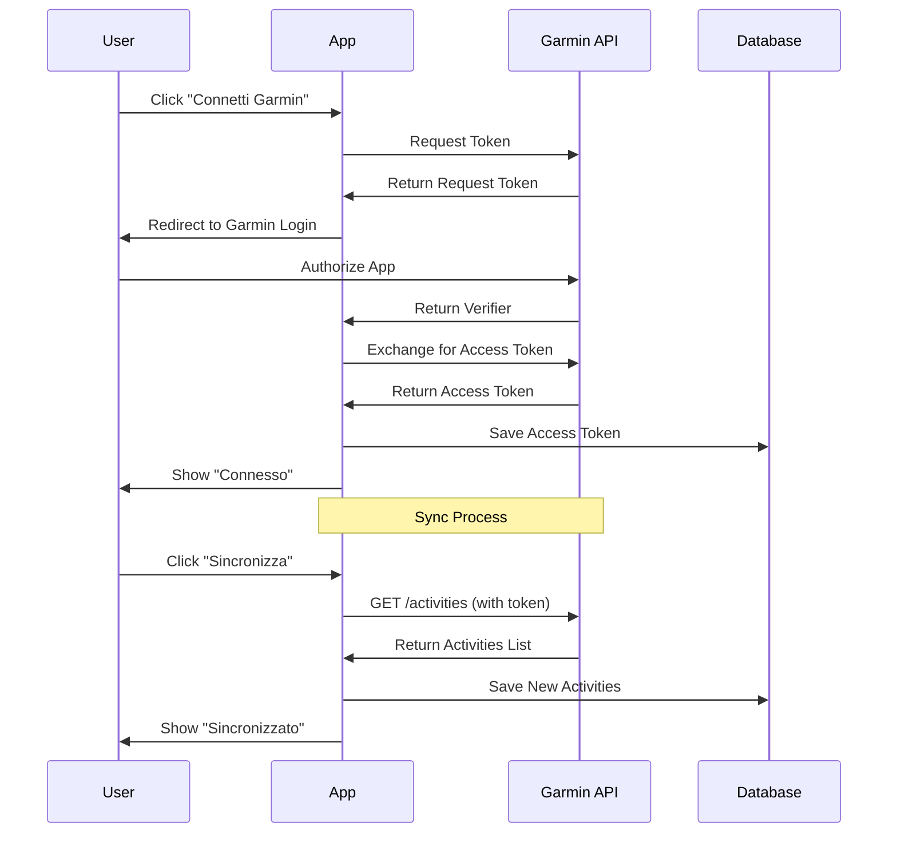
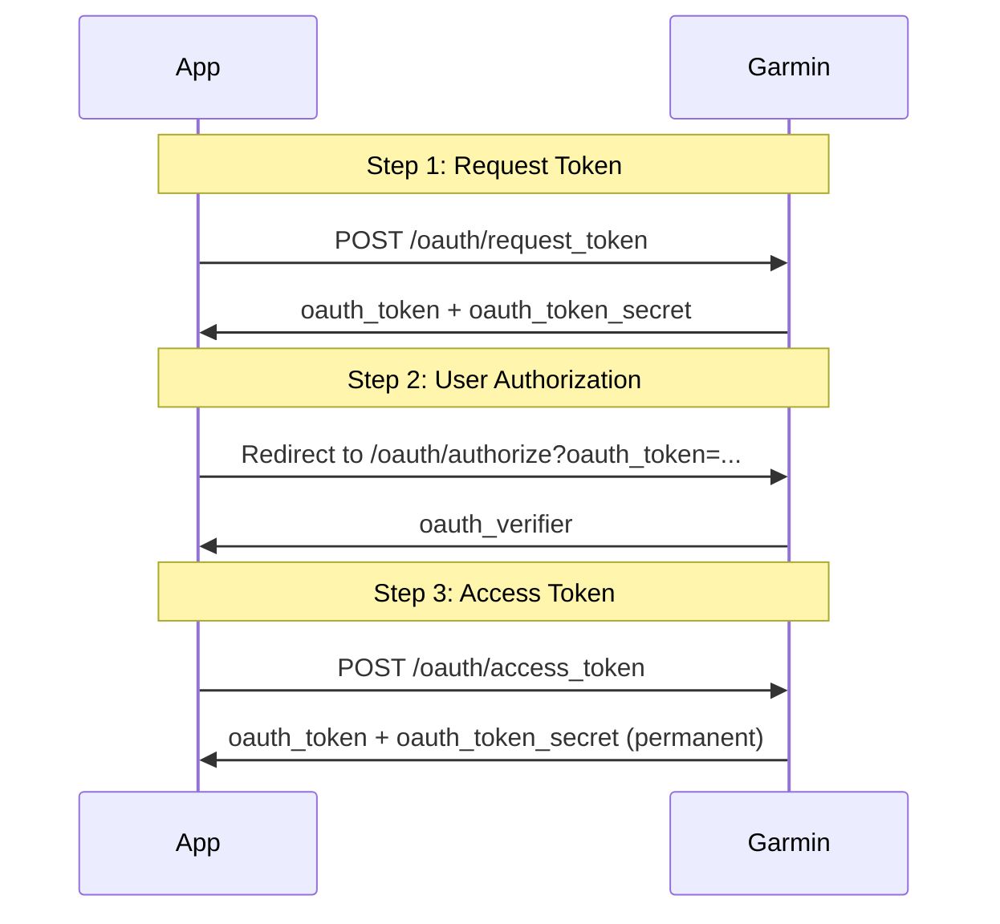

# 🏃 Integrazione Garmin Connect API

## 📋 Indice

1. [Panoramica](#panoramica)
2. [Registrazione Developer](#registrazione-developer)
3. [OAuth 1.0a Setup](#oauth-10a-setup)
4. [API Endpoints](#api-endpoints)
5. [Implementazione Bubble.io](#implementazione-bubbleio)
6. [Implementazione Softr](#implementazione-softr)
7. [Sync Workflow](#sync-workflow)
8. [Data Mapping](#data-mapping)
9. [Error Handling](#error-handling)
10. [Testing](#testing)

---

## 1. Panoramica

### 1.1 Cos'è Garmin Connect API

Garmin Connect API permette di accedere ai dati delle attività registrate con dispositivi Garmin (orologi, ciclocomputer, ecc.).

**Funzionalità Principali:**
- Recupero lista attività
- Dettagli attività (distanza, tempo, FC, GPS)
- Dati biometrici (peso, sonno, stress)
- Statistiche aggregate

### 1.2 Limitazioni

**Piano Gratuito:**
- Rate limit: 100 richieste/giorno per utente
- Dati disponibili: ultimi 90 giorni
- No accesso real-time
- No webhook notifications

**Considerazioni:**
- OAuth 1.0a (più complesso di OAuth 2.0)
- Documentazione limitata
- Supporto community-based

### 1.3 Flusso Integrazione



---

## 2. Registrazione Developer

### 2.1 Creazione Account

**Step 1: Registrazione**
```
1. Vai su https://developer.garmin.com
2. Click "Sign In" (usa account Garmin esistente)
3. Accetta Terms of Service
4. Completa profilo developer
```

**Step 2: Creazione App**
```
1. Dashboard → "Create an App"
2. Compila form:
   - App Name: Fitness Tracker
   - Description: Personal fitness tracking application
   - App Type: Web Application
   - OAuth Callback URL: 
     * Bubble: https://[your-app].bubbleapps.io/api/1.1/oauth_redirect
     * Softr: https://[your-app].softr.app/oauth/callback
3. Submit for review
```

**Step 3: Ottenere Credenziali**
```
Dopo approvazione (1-3 giorni):
1. Dashboard → Your Apps → Fitness Tracker
2. Copia:
   - Consumer Key
   - Consumer Secret
3. Salva in luogo sicuro (NON committare su Git!)
```

### 2.2 Configurazione App

**Impostazioni Consigliate:**
```
App Settings:
- OAuth Version: 1.0a
- Callback URL: [your-callback-url]
- Permissions: Read Activities, Read User Profile
- Rate Limit: Default (100 req/day/user)
```

---

## 3. OAuth 1.0a Setup

### 3.1 Flusso OAuth 1.0a



### 3.2 Parametri OAuth

**Request Token:**
```
POST https://connectapi.garmin.com/oauth-service/oauth/request_token

Headers:
- Authorization: OAuth oauth_consumer_key="[KEY]",
                      oauth_signature_method="HMAC-SHA1",
                      oauth_timestamp="[TIMESTAMP]",
                      oauth_nonce="[NONCE]",
                      oauth_version="1.0",
                      oauth_signature="[SIGNATURE]"
```

**Authorization URL:**
```
https://connect.garmin.com/oauthConfirm?oauth_token=[TOKEN]
```

**Access Token:**
```
POST https://connectapi.garmin.com/oauth-service/oauth/access_token

Parameters:
- oauth_token: [from step 1]
- oauth_verifier: [from step 2]
- oauth_consumer_key: [your key]
- oauth_signature: [calculated]
```

### 3.3 Signature Calculation

**HMAC-SHA1 Signature:**
```javascript
// Pseudo-code
base_string = HTTP_METHOD + "&" + 
              URL_ENCODE(base_url) + "&" + 
              URL_ENCODE(sorted_parameters)

signing_key = URL_ENCODE(consumer_secret) + "&" + 
              URL_ENCODE(token_secret)

signature = HMAC_SHA1(signing_key, base_string)
oauth_signature = BASE64(signature)
```

---

## 4. API Endpoints

### 4.1 Endpoints Principali

**Base URL:**
```
https://apis.garmin.com/wellness-api/rest
```

**Autenticazione:**
```
Tutte le richieste richiedono OAuth 1.0a header
```

### 4.2 Activities

**GET /activities**
```
Endpoint: /activities
Method: GET
Parameters:
  - uploadStartTimeInSeconds: timestamp (required)
  - uploadEndTimeInSeconds: timestamp (required)
  
Response:
[
  {
    "activityId": 123456789,
    "activityName": "Morning Run",
    "activityType": "RUNNING",
    "startTimeGMT": "2026-06-09T04:30:00.0",
    "startTimeLocal": "2026-06-09T06:30:00.0",
    "distance": 10500,
    "duration": 3083,
    "averageSpeed": 3.41,
    "maxSpeed": 4.2,
    "averageHR": 142,
    "maxHR": 165,
    "calories": 520,
    "elevationGain": 45,
    "elevationLoss": 42
  }
]
```

**GET /activities/{activityId}**
```
Endpoint: /activities/{activityId}
Method: GET

Response:
{
  "activityId": 123456789,
  "activityName": "Morning Run",
  "description": "Easy run in the park",
  "startTimeGMT": "2026-06-09T04:30:00.0",
  "distance": 10500,
  "duration": 3083,
  "averageSpeed": 3.41,
  "averageHR": 142,
  "maxHR": 165,
  "averageRunCadence": 172,
  "maxRunCadence": 180,
  "calories": 520,
  "elevationGain": 45,
  "splits": [
    {
      "distance": 1000,
      "duration": 302,
      "averageSpeed": 3.31,
      "averageHR": 138
    }
  ],
  "hrZones": [
    {"zone": 1, "timeInZone": 462},
    {"zone": 2, "timeInZone": 1850},
    {"zone": 3, "timeInZone": 617},
    {"zone": 4, "timeInZone": 154},
    {"zone": 5, "timeInZone": 0}
  ]
}
```

### 4.3 User Profile

**GET /user/profile**
```
Endpoint: /user/profile
Method: GET

Response:
{
  "userId": "user-123",
  "displayName": "Mario Rossi",
  "profileImageUrl": "https://...",
  "userPro": false
}
```

### 4.4 Daily Summary

**GET /dailies**
```
Endpoint: /dailies
Method: GET
Parameters:
  - uploadStartTimeInSeconds: timestamp
  - uploadEndTimeInSeconds: timestamp

Response:
[
  {
    "summaryId": "daily-123",
    "calendarDate": "2026-06-09",
    "totalSteps": 12500,
    "totalDistance": 8500,
    "activeTime": 3600,
    "calories": 2100,
    "bmr": 1650,
    "activeCalories": 450
  }
]
```

---

## 5. Implementazione Bubble.io

### 5.1 API Connector Setup

**Step 1: Installa Plugin**
```
1. Plugins → Add plugins
2. Cerca "API Connector"
3. Install
```

**Step 2: Configura API**
```
1. Plugins → API Connector → Add another API
2. Nome: Garmin Connect
3. Authentication: OAuth 1.0a
4. Consumer Key: [your key]
5. Consumer Secret: [your secret]
6. Request Token URL: https://connectapi.garmin.com/oauth-service/oauth/request_token
7. Authorization URL: https://connect.garmin.com/oauthConfirm
8. Access Token URL: https://connectapi.garmin.com/oauth-service/oauth/access_token
9. Signature Method: HMAC-SHA1
```

**Step 3: Aggiungi Calls**

**Call: Get Activities**
```
Name: Get Activities
Use as: Data
Method: GET
URL: https://apis.garmin.com/wellness-api/rest/activities
Parameters:
  - uploadStartTimeInSeconds (number, required)
  - uploadEndTimeInSeconds (number, required)

Headers:
  - Accept: application/json

Response:
[Initialize call con date di test]
```

**Call: Get Activity Detail**
```
Name: Get Activity Detail
Use as: Data
Method: GET
URL: https://apis.garmin.com/wellness-api/rest/activities/[activityId]
Parameters:
  - activityId (number, required, in path)

Headers:
  - Accept: application/json
```

### 5.2 Workflow Connessione

**Pagina: settings**

**Button: "Connetti Garmin"**
```
Workflow:
1. When Button "Connetti Garmin" is clicked
2. Account → Signup/login with a social network
   - OAuth provider: Garmin Connect
   - Navigate to: settings (after auth)
```

**Display Connection Status:**
```
Element: Text
Content: 
  When Current User's Garmin token is not empty:
    "✅ Connesso"
  Otherwise:
    "❌ Non connesso"
```

### 5.3 Workflow Sincronizzazione

**Button: "Sincronizza Ora"**
```
Workflow:
1. When Button "Sincronizza Ora" is clicked

Step 1: Calculate timestamps
  - Set state "sync_start": Current date/time - 7 days (in seconds)
  - Set state "sync_end": Current date/time (in seconds)

Step 2: API Call
  - Plugin: Garmin Connect - Get Activities
  - uploadStartTimeInSeconds: sync_start
  - uploadEndTimeInSeconds: sync_end

Step 3: Process results
  - For each item in API response:
    
    Step 3a: Check if exists
      - Do a search for Running_Activity
      - Constraint: garmin_activity_id = This item's activityId
      
    Step 3b: If not exists, create
      - Create Running_Activity
        * user = Current User
        * date = This item's startTimeLocal
        * type = "Medio" (default, può essere raffinato)
        * distance_km = This item's distance / 1000
        * duration_seconds = This item's duration
        * avg_pace = Calculate from distance and duration
        * avg_hr = This item's averageHR
        * max_hr = This item's maxHR
        * cadence = This item's averageRunCadence
        * elevation_m = This item's elevationGain
        * calories = This item's calories
        * garmin_activity_id = This item's activityId
        * garmin_raw_data = This item (entire JSON)

Step 4: Show result
  - Show alert: "Sincronizzate X attività"
  - Navigate to: running-dashboard
```

### 5.4 Custom States

```
Page: settings
Custom States:
  - sync_start (number)
  - sync_end (number)
  - sync_count (number)
  - sync_in_progress (yes/no)
```

---

## 6. Implementazione Softr

### 6.1 Limitazioni Softr

**Problema:**
Softr non supporta nativamente OAuth 1.0a

**Soluzioni:**

**Opzione A: Zapier/Make (Consigliata)**
```
1. Usa Zapier o Make.com come middleware
2. Trigger: Webhook da Softr
3. Action: Garmin API call
4. Response: Update Airtable
```

**Opzione B: Custom Code Block**
```
1. Usa Custom Code block in Softr
2. Implementa OAuth 1.0a in JavaScript
3. Chiama API direttamente
4. Aggiorna Airtable via API
```

### 6.2 Setup con Zapier

**Step 1: Crea Zap**
```
1. Trigger: Webhooks by Zapier
   - Catch Hook
   - Copia Webhook URL

2. Action: HTTP by Zapier
   - Method: GET
   - URL: https://apis.garmin.com/wellness-api/rest/activities
   - Headers: OAuth 1.0a (configurato in Zapier)
   - Query Params: timestamps

3. Action: Airtable
   - Create Record
   - Base: Fitness Tracker DB
   - Table: Running_Activities
   - Fields: Map from Garmin response
```

**Step 2: Trigger da Softr**
```
Custom Code Block in Softr:

<button onclick="syncGarmin()">Sincronizza Garmin</button>

<script>
async function syncGarmin() {
  const webhookUrl = 'YOUR_ZAPIER_WEBHOOK_URL';
  const userId = 'CURRENT_USER_ID'; // Da Softr context
  
  const response = await fetch(webhookUrl, {
    method: 'POST',
    headers: {'Content-Type': 'application/json'},
    body: JSON.stringify({
      userId: userId,
      startTime: Math.floor(Date.now()/1000) - 604800, // 7 days ago
      endTime: Math.floor(Date.now()/1000)
    })
  });
  
  if (response.ok) {
    alert('Sincronizzazione completata!');
    location.reload();
  }
}
</script>
```

### 6.3 Setup con Make.com

**Scenario:**
```
1. Webhook Trigger
   - Receive webhook from Softr
   - Parse user_id and timestamps

2. HTTP Module
   - OAuth 1.0a authentication
   - GET Garmin activities
   - Parse response

3. Iterator
   - Loop through activities

4. Airtable Module
   - Search for existing record
   - If not found: Create new record
   - Map fields

5. Response
   - Return count of synced activities
```

---

## 7. Sync Workflow

### 7.1 Strategia Sync

**Opzioni:**

**A. Manual Sync (Consigliata per inizio)**
```
- User clicks "Sincronizza"
- App fetches last 7 days
- Creates new activities
- Shows confirmation
```

**B. Scheduled Sync**
```
- Bubble: Backend workflow scheduled
- Runs daily at 6 AM
- Syncs all users
- Sends email summary
```

**C. Real-time Sync**
```
- Not supported by Garmin API
- Would require polling
- Not recommended (rate limits)
```

### 7.2 Sync Logic

```javascript
// Pseudo-code

function syncGarminActivities(userId) {
  // 1. Get user's last sync date
  const lastSync = getLastSyncDate(userId);
  const now = Date.now();
  
  // 2. Calculate time range
  const startTime = lastSync || (now - 7 * 24 * 60 * 60 * 1000);
  const endTime = now;
  
  // 3. Fetch activities from Garmin
  const activities = garminAPI.getActivities(startTime, endTime);
  
  // 4. Process each activity
  let newCount = 0;
  for (const activity of activities) {
    // Check if already exists
    const exists = database.findOne({
      garmin_activity_id: activity.activityId
    });
    
    if (!exists) {
      // Create new activity
      database.create({
        user_id: userId,
        date: activity.startTimeLocal,
        type: determineType(activity),
        distance_km: activity.distance / 1000,
        duration_seconds: activity.duration,
        avg_pace: calculatePace(activity.distance, activity.duration),
        avg_hr: activity.averageHR,
        max_hr: activity.maxHR,
        cadence: activity.averageRunCadence,
        elevation_m: activity.elevationGain,
        calories: activity.calories,
        garmin_activity_id: activity.activityId,
        garmin_raw_data: activity
      });
      newCount++;
    }
  }
  
  // 5. Update last sync date
  updateLastSyncDate(userId, now);
  
  // 6. Return result
  return {
    success: true,
    newActivities: newCount,
    totalActivities: activities.length
  };
}

function determineType(activity) {
  // Logic to determine run type based on pace, HR, etc.
  const paceMinPerKm = (activity.duration / 60) / (activity.distance / 1000);
  
  if (paceMinPerKm > 6) return "Facile";
  if (paceMinPerKm > 5) return "Medio";
  if (paceMinPerKm > 4) return "Veloce";
  if (activity.distance > 15000) return "Lungo";
  return "Medio";
}

function calculatePace(distanceMeters, durationSeconds) {
  const km = distanceMeters / 1000;
  const minutes = durationSeconds / 60;
  const paceMinPerKm = minutes / km;
  
  const min = Math.floor(paceMinPerKm);
  const sec = Math.round((paceMinPerKm - min) * 60);
  
  return `${min}:${sec.toString().padStart(2, '0')}`;
}
```

### 7.3 Conflict Resolution

**Scenario: Attività modificata su Garmin**
```
Strategy: Last write wins

1. Check if activity exists (by garmin_activity_id)
2. If exists:
   - Compare updated_at timestamps
   - If Garmin is newer: Update local
   - If local is newer: Keep local (or ask user)
3. If not exists: Create new
```

---

## 8. Data Mapping

### 8.1 Garmin → Database

```javascript
// Mapping completo
{
  // Direct mappings
  garmin_activity_id: garmin.activityId,
  date: garmin.startTimeLocal,
  distance_km: garmin.distance / 1000,
  duration_seconds: garmin.duration,
  avg_hr: garmin.averageHR,
  max_hr: garmin.maxHR,
  cadence: garmin.averageRunCadence,
  elevation_m: garmin.elevationGain,
  calories: garmin.calories,
  
  // Calculated fields
  avg_pace: calculatePace(garmin.distance, garmin.duration),
  type: determineType(garmin),
  
  // JSON fields
  hr_zones: {
    z1: {
      percentage: calculatePercentage(garmin.hrZones[0].timeInZone, garmin.duration),
      duration_seconds: garmin.hrZones[0].timeInZone
    },
    z2: {...},
    z3: {...},
    z4: {...},
    z5: {...}
  },
  
  // Raw data (for future use)
  garmin_raw_data: garmin
}
```

### 8.2 Field Transformations

**Distance:**
```javascript
// Garmin: meters
// Database: kilometers
distance_km = garmin.distance / 1000
```

**Pace:**
```javascript
// Calculate from distance and duration
const km = distance_meters / 1000;
const minutes = duration_seconds / 60;
const pace_min_per_km = minutes / km;

// Format as MM:SS
const min = Math.floor(pace_min_per_km);
const sec = Math.round((pace_min_per_km - min) * 60);
avg_pace = `${min}:${sec.toString().padStart(2, '0')}`;
```

**HR Zones:**
```javascript
// Garmin provides time in each zone
// Calculate percentages
const total_time = garmin.duration;
hr_zones = garmin.hrZones.map(zone => ({
  zone: zone.zone,
  percentage: (zone.timeInZone / total_time) * 100,
  duration_seconds: zone.timeInZone
}));
```

**Activity Type:**
```javascript
// Determine type based on metrics
function determineType(activity) {
  const pace = calculatePace(activity.distance, activity.duration);
  const distance_km = activity.distance / 1000;
  
  // Long run
  if (distance_km > 15) return "Lungo";
  
  // Fast run
  if (pace < 4.5) return "Veloce";
  
  // Easy run
  if (pace > 5.5) return "Facile";
  
  // Recovery
  if (pace > 6.5) return "Recupero";
  
  // Default: Medium
  return "Medio";
}
```

---

## 9. Error Handling

### 9.1 Errori Comuni

**401 Unauthorized:**
```
Causa: Token scaduto o invalido
Soluzione:
1. Mostra messaggio "Riconnetti Garmin"
2. Richiedi nuova autorizzazione
3. Aggiorna token
```

**429 Too Many Requests:**
```
Causa: Rate limit superato
Soluzione:
1. Mostra messaggio "Troppi tentativi"
2. Suggerisci di riprovare tra X minuti
3. Implementa exponential backoff
```

**404 Not Found:**
```
Causa: Attività non trovata
Soluzione:
1. Skip questa attività
2. Log errore
3. Continua con prossima
```

**500 Server Error:**
```
Causa: Problema server Garmin
Soluzione:
1. Retry con backoff
2. Se persiste: mostra errore
3. Suggerisci di riprovare più tardi
```

### 9.2 Error Handling Code

```javascript
async function syncWithErrorHandling(userId) {
  try {
    const result = await syncGarminActivities(userId);
    return {
      success: true,
      data: result
    };
  } catch (error) {
    if (error.status === 401) {
      return {
        success: false,
        error: "auth_required",
        message: "Devi riconnettere il tuo account Garmin"
      };
    }
    
    if (error.status === 429) {
      return {
        success: false,
        error: "rate_limit",
        message: "Troppi tentativi. Riprova tra 1 ora."
      };
    }
    
    if (error.status >= 500) {
      return {
        success: false,
        error: "server_error",
        message: "Problema temporaneo con Garmin. Riprova più tardi."
      };
    }
    
    // Generic error
    return {
      success: false,
      error: "unknown",
      message: "Errore durante la sincronizzazione"
    };
  }
}
```

### 9.3 User Feedback

**Bubble.io:**
```
Workflow:
1. API call completes
2. Check response status
3. Show appropriate alert:
   - Success: "✅ Sincronizzate X attività"
   - Auth error: "⚠️ Riconnetti Garmin"
   - Rate limit: "⏳ Riprova tra 1 ora"
   - Server error: "❌ Errore temporaneo"
```

---

## 10. Testing

### 10.1 Test Checklist

```
✓ OAuth flow completo
✓ Token salvato correttamente
✓ Fetch activities (vuoto)
✓ Fetch activities (con dati)
✓ Create new activity
✓ Skip existing activity
✓ Handle errors (401, 429, 500)
✓ Disconnect account
✓ Reconnect account
✓ Sync multiple times
✓ Data mapping corretto
```

### 10.2 Test con Postman

**Collection: Garmin Connect API**

**Request 1: Get Request Token**
```
POST https://connectapi.garmin.com/oauth-service/oauth/request_token
Authorization: OAuth 1.0
  - Consumer Key: [your key]
  - Consumer Secret: [your secret]
  - Signature Method: HMAC-SHA1

Expected: oauth_token + oauth_token_secret
```

**Request 2: Get Activities**
```
GET https://apis.garmin.com/wellness-api/rest/activities
Authorization: OAuth 1.0
  - Consumer Key: [your key]
  - Consumer Secret: [your secret]
  - Token: [from step 1]
  - Token Secret: [from step 1]
  
Query Params:
  - uploadStartTimeInSeconds: 1717891200
  - uploadEndTimeInSeconds: 1718496000

Expected: Array of activities
```

### 10.3 Test Scenarios

**Scenario 1: First Sync**
```
1. User connects Garmin (no previous sync)
2. Click "Sincronizza"
3. Expect: All activities from last 7 days imported
4. Verify: Activities in database
5. Verify: garmin_activity_id populated
```

**Scenario 2: Incremental Sync**
```
1. User already synced before
2. New activity on Garmin
3. Click "Sincronizza"
4. Expect: Only new activity imported
5. Verify: No duplicates
```

**Scenario 3: Token Expired**
```
1. Token expired (simulate)
2. Click "Sincronizza"
3. Expect: Error message
4. Click "Riconnetti"
5. Complete OAuth flow
6. Retry sync
7. Expect: Success
```

---

## 11. Best Practices

### 11.1 Security

```
✓ Never expose Consumer Secret in frontend
✓ Store tokens encrypted
✓ Use HTTPS only
✓ Implement CSRF protection
✓ Validate all API responses
✓ Log security events
```

### 11.2 Performance

```
✓ Batch API calls when possible
✓ Cache responses (with TTL)
✓ Use pagination for large datasets
✓ Implement rate limiting on your side
✓ Async processing for sync
✓ Show progress indicators
```

### 11.3 User Experience

```
✓ Clear connection status
✓ Easy reconnect flow
✓ Progress feedback during sync
✓ Error messages user-friendly
✓ Option to disconnect
✓ Manual sync button always visible
```

---

## 12. Troubleshooting

### 12.1 OAuth Issues

**Problem: "Invalid signature"**
```
Cause: Incorrect signature calculation
Solution:
1. Verify Consumer Key/Secret
2. Check timestamp format
3. Verify parameter encoding
4. Use OAuth debugger tool
```

**Problem: "Token expired"**
```
Cause: Access token no longer valid
Solution:
1. Clear stored token
2. Restart OAuth flow
3. Get new access token
```

### 12.2 API Issues

**Problem: "No activities returned"**
```
Cause: Wrong time range or no activities
Solution:
1. Verify timestamps (Unix seconds)
2. Check date range
3. Verify user has activities on Garmin
```

**Problem: "Rate limit exceeded"**
```
Cause: Too many requests
Solution:
1. Implement exponential backoff
2. Cache responses
3. Reduce sync frequency
```

---

## 📚 Risorse

### Documentazione
- [Garmin Developer Portal](https://developer.garmin.com)
- [Garmin Connect API Docs](https://developer.garmin.com/connect-api/docs)
- [OAuth 1.0a Spec](https://oauth.net/core/1.0a/)

### Tools
- [OAuth Signature Generator](https://oauth-signature-generator.appspot.com/)
- [Postman OAuth 1.0a](https://learning.postman.com/docs/sending-requests/authorization/#oauth-10)
- [JWT.io](https://jwt.io/) (for debugging tokens)

### Community
- [Garmin Developer Forum](https://forums.garmin.com/developer/)
- [Stack Overflow](https://stackoverflow.com/questions/tagged/garmin-connect)

---

**Versione:** 1.0  
**Data:** Giugno 2026  
**Autore:** Bob - Software Engineer  
**Licenza:** MIT