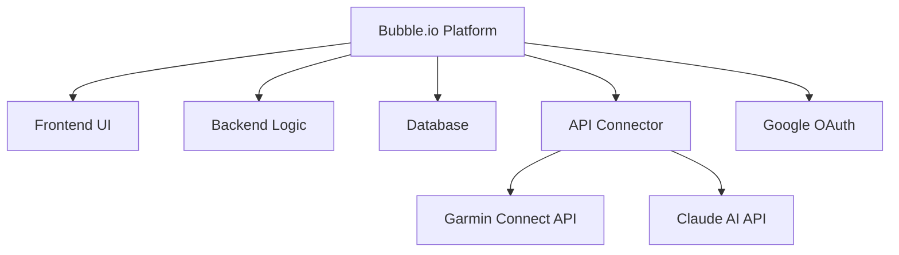
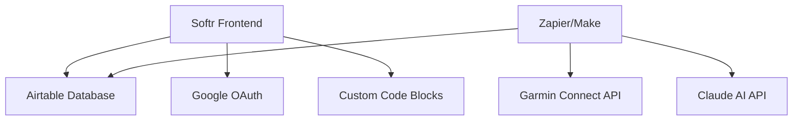
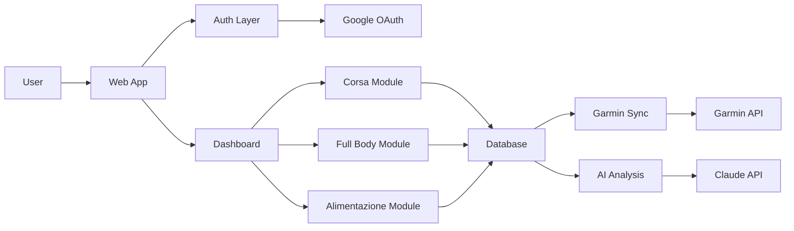
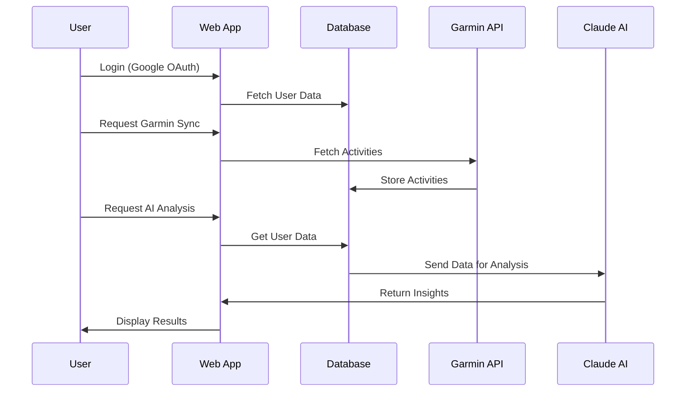
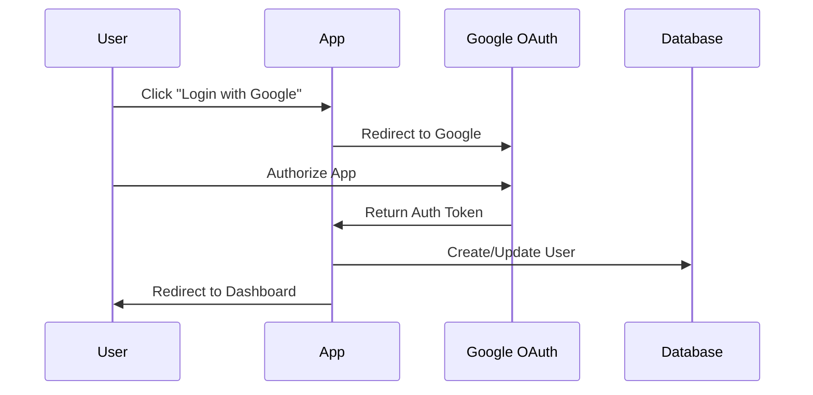
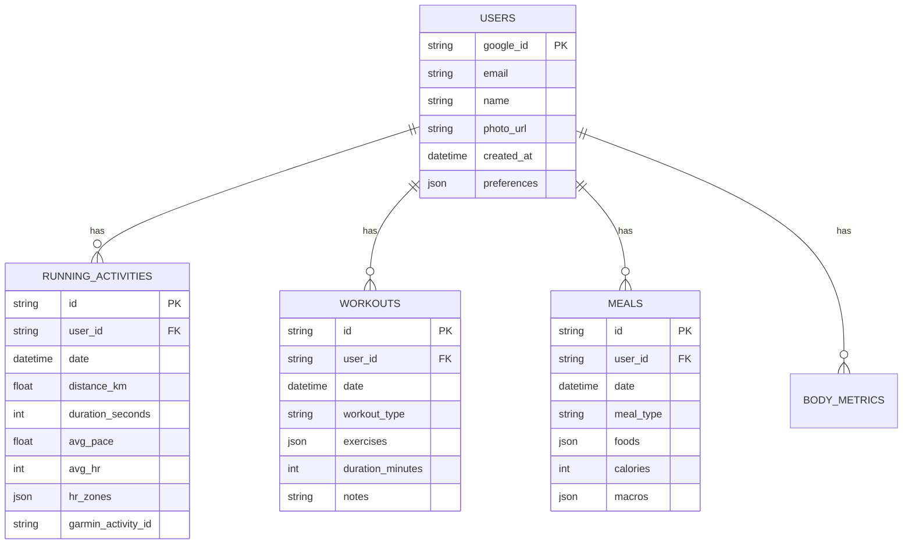
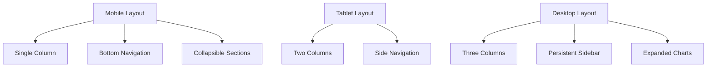

# 🏋️ Progetto Sito Fitness Tracker

## 📋 Panoramica del Progetto

Un'applicazione web completa per il tracking e l'analisi delle attività fitness, con focus su corsa, allenamento full body e alimentazione. Il sistema integra dati da Garmin Connect e utilizza Claude AI per fornire analisi personalizzate e consigli.

## 🎯 Obiettivi

- **Tracking Completo**: Monitoraggio di corsa, allenamenti e alimentazione
- **Integrazione Dati**: Sincronizzazione automatica con Garmin Connect
- **Analisi AI**: Insights personalizzati tramite Claude AI
- **Accessibilità**: Mobile-first, responsive, facile da usare
- **Costo Zero**: Utilizzo di piattaforme gratuite

## 🛠️ Stack Tecnologico

### Opzione A: Bubble.io (Consigliata per Principianti)


**Vantaggi:**
- ✅ All-in-one: frontend, backend, database integrati
- ✅ Visual programming: no codice necessario
- ✅ Hosting gratuito incluso
- ✅ SSL automatico
- ✅ Responsive design builder
- ✅ Plugin marketplace ricco

**Limitazioni Piano Gratuito:**
- 50 GB storage
- Custom domain non incluso (usa subdomain bubble.io)
- Branding Bubble presente

### Opzione B: Softr + Airtable (Consigliata per Flessibilità)


**Vantaggi:**
- ✅ Airtable: database potente e flessibile
- ✅ Softr: UI templates professionali
- ✅ Facile gestione dati in Airtable
- ✅ Integrazioni via Zapier/Make

**Limitazioni Piano Gratuito:**
- Airtable: 1,200 records per base
- Softr: 3 pagine, branding presente
- Zapier: 100 tasks/mese

## 🏗️ Architettura del Sistema

### Componenti Principali



### Flusso Dati



## 📊 Struttura delle Sezioni

### 1. Sezione Corsa 🏃

**Funzionalità:**
- Dashboard con metriche chiave (distanza, tempo, passo, FC)
- Calendario allenamenti
- Grafici progressione
- Zone di frequenza cardiaca
- Analisi AI delle performance

**Dati Tracciati:**
- Data e ora
- Distanza (km)
- Durata
- Passo medio/km
- Frequenza cardiaca (media, max, zone)
- Cadenza
- Elevazione
- Calorie
- Note personali

### 2. Sezione Full Body 💪

**Funzionalità:**
- Libreria esercizi
- Schede allenamento personalizzate
- Tracking serie/ripetizioni/peso
- Progressione forza
- Video/immagini esercizi
- Timer rest

**Dati Tracciati:**
- Data allenamento
- Esercizi eseguiti
- Serie x Ripetizioni x Peso
- Tempo di recupero
- RPE (Rate of Perceived Exertion)
- Note e sensazioni
- Foto progressi (opzionale)

### 3. Sezione Alimentazione 🥗

**Funzionalità:**
- Diario alimentare
- Calcolo macronutrienti
- Obiettivi calorici
- Grafici trend peso
- Idratazione
- Analisi AI abitudini alimentari

**Dati Tracciati:**
- Data e pasto
- Alimenti consumati
- Calorie
- Proteine/Carboidrati/Grassi
- Peso corporeo
- Acqua bevuta
- Note e sensazioni

## 🔐 Sistema di Autenticazione

### Google OAuth Implementation



**Dati Utente Memorizzati:**
- Google ID (unique identifier)
- Email
- Nome
- Foto profilo
- Data registrazione
- Preferenze utente

## 💾 Database Schema Overview

### Tabelle Principali



## 🔌 Integrazioni API

### Garmin Connect API

**Endpoint Principali:**
- `/activities` - Lista attività
- `/activities/{id}` - Dettaglio attività
- `/heartRate` - Dati frequenza cardiaca
- `/userSummary` - Riepilogo utente

**Autenticazione:** OAuth 1.0a

### Claude AI API

**Utilizzi:**
- Analisi trend performance
- Suggerimenti allenamento
- Consigli alimentari
- Identificazione pattern
- Previsioni obiettivi

**Endpoint:** Anthropic API v1

## 📱 Design Responsive

### Breakpoints

```css
/* Mobile First Approach */
Mobile: 320px - 767px (default)
Tablet: 768px - 1023px
Desktop: 1024px+
```

### Layout Strategy



## 🎨 Design System

### Colori

```
Primary: #2563EB (Blue)
Secondary: #10B981 (Green)
Accent: #F59E0B (Orange)
Background: #F9FAFB (Light Gray)
Text: #111827 (Dark Gray)
Error: #EF4444 (Red)
Success: #10B981 (Green)
```

### Typography

```
Headings: Inter, sans-serif
Body: Inter, sans-serif
Monospace: Fira Code, monospace

H1: 32px / 2rem
H2: 24px / 1.5rem
H3: 20px / 1.25rem
Body: 16px / 1rem
Small: 14px / 0.875rem
```

## 🚀 Piano di Implementazione

### Fase 1: Setup Iniziale (Settimana 1)
- [ ] Creazione account Bubble.io o Softr + Airtable
- [ ] Setup Google OAuth
- [ ] Design database schema
- [ ] Creazione pagine base

### Fase 2: Sezione Corsa (Settimana 2-3)
- [ ] UI dashboard corsa
- [ ] Form inserimento manuale
- [ ] Grafici e statistiche
- [ ] Integrazione Garmin (base)

### Fase 3: Sezione Full Body (Settimana 4-5)
- [ ] Libreria esercizi
- [ ] Form tracking workout
- [ ] Visualizzazione progressi
- [ ] Timer e cronometro

### Fase 4: Sezione Alimentazione (Settimana 6-7)
- [ ] Diario alimentare
- [ ] Calcolo macros
- [ ] Grafici peso e trend
- [ ] Database alimenti

### Fase 5: Integrazioni Avanzate (Settimana 8-9)
- [ ] Garmin Connect sync completo
- [ ] Claude AI integration
- [ ] Analisi automatiche
- [ ] Notifiche e reminder

### Fase 6: Testing e Ottimizzazione (Settimana 10)
- [ ] Test su dispositivi multipli
- [ ] Ottimizzazione performance
- [ ] Bug fixing
- [ ] Documentazione utente

## 📈 Metriche di Successo

### KPI Tecnici
- Tempo di caricamento < 3 secondi
- Mobile responsive 100%
- Uptime > 99%
- Sync Garmin < 5 minuti

### KPI Utente
- Facilità d'uso (SUS Score > 70)
- Retention rate > 60% (30 giorni)
- Engagement quotidiano > 40%
- Soddisfazione utente > 4/5

## 🔒 Sicurezza e Privacy

### Misure di Sicurezza
- ✅ HTTPS obbligatorio
- ✅ OAuth 2.0 per autenticazione
- ✅ Token encryption
- ✅ Rate limiting API
- ✅ Input validation
- ✅ XSS protection

### Privacy
- ✅ GDPR compliant
- ✅ Dati criptati at rest
- ✅ Opzione export dati
- ✅ Diritto all'oblio
- ✅ Privacy policy chiara
- ✅ Cookie consent

## 💰 Costi e Scalabilità

### Piano Gratuito (Inizio)
```
Bubble.io Free: $0/mese
- 50 GB storage
- Subdomain incluso
- Branding Bubble

Alternativa:
Softr Free: $0/mese
Airtable Free: $0/mese
- Limitazioni records
- Branding presente
```

### Piano Crescita (Futuro)
```
Bubble.io Personal: $29/mese
- Custom domain
- No branding
- 20 GB storage

Alternativa:
Softr Starter: $29/mese
Airtable Plus: $10/mese
Total: $39/mese
```

## 🎓 Risorse di Apprendimento

### Bubble.io
- [Bubble Manual](https://manual.bubble.io/)
- [Bubble Academy](https://bubble.io/academy)
- [YouTube Tutorials](https://www.youtube.com/c/bubbleio)

### Softr + Airtable
- [Softr University](https://university.softr.io/)
- [Airtable Support](https://support.airtable.com/)
- [Template Gallery](https://www.softr.io/templates)

### API Integration
- [Garmin Connect API Docs](https://developer.garmin.com/)
- [Anthropic Claude API](https://docs.anthropic.com/)
- [Google OAuth Guide](https://developers.google.com/identity/protocols/oauth2)

## 📞 Supporto e Community

### Forum e Community
- Bubble Forum: forum.bubble.io
- Softr Community: community.softr.io
- Reddit: r/nocode, r/Bubble

### Assistenza
- Bubble Support: support@bubble.io
- Softr Support: support@softr.io
- Stack Overflow: tag [bubble.io], [softr]

## 🔄 Roadmap Futura

### V2.0 Features
- [ ] App mobile nativa (iOS/Android)
- [ ] Integrazione Apple Health
- [ ] Social features (condivisione, sfide)
- [ ] Coach virtuale AI avanzato
- [ ] Piani allenamento generati da AI
- [ ] Marketplace schede allenamento

### V3.0 Features
- [ ] Wearable integration (Apple Watch, Fitbit)
- [ ] Video coaching integrato
- [ ] Community e gruppi
- [ ] Gamification completa
- [ ] Marketplace nutrizione

## 📝 Note Implementative

### Best Practices
1. **Mobile First**: Progetta prima per mobile
2. **Progressive Enhancement**: Funzionalità base prima, avanzate dopo
3. **User Testing**: Test continui con utenti reali
4. **Iterative Development**: Rilasci frequenti e incrementali
5. **Data Backup**: Backup automatici giornalieri

### Errori Comuni da Evitare
- ❌ Non testare su dispositivi reali
- ❌ Ignorare la performance
- ❌ UI troppo complessa
- ❌ Non validare input utente
- ❌ Dimenticare error handling
- ❌ Non documentare il codice

## 🎯 Conclusioni

Questo progetto rappresenta una soluzione completa e moderna per il fitness tracking, utilizzando tecnologie no-code/low-code per ridurre tempi e costi di sviluppo. L'architettura modulare permette di iniziare con funzionalità base e scalare progressivamente.

**Prossimi Passi:**
1. Scegliere tra Bubble.io o Softr+Airtable
2. Creare account e setup iniziale
3. Seguire la guida implementazione
4. Iniziare con la sezione più importante per te

---

**Versione:** 1.0  
**Data:** Giugno 2026  
**Autore:** Bob - Software Engineer  
**Licenza:** MIT