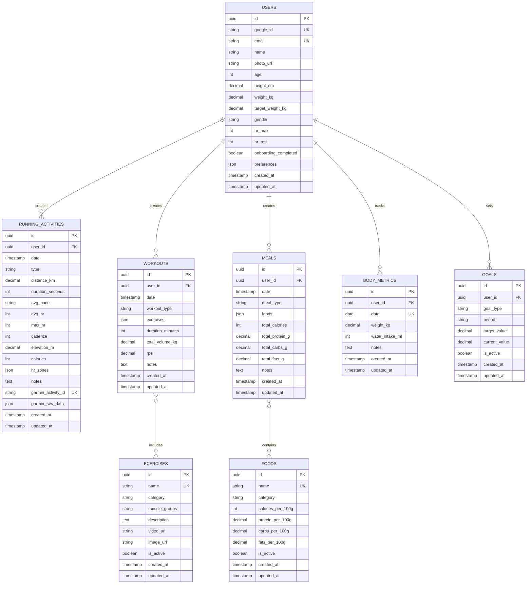
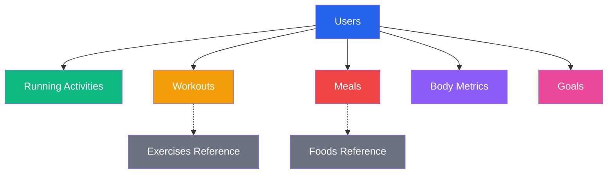
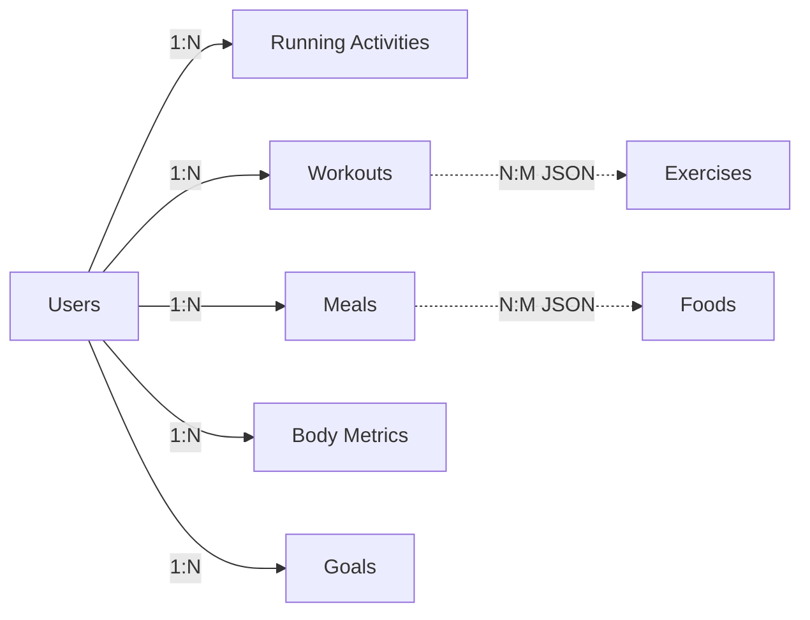

# 💾 Schema Database - Fitness Tracker

## 📋 Indice

1. [Panoramica](#panoramica)
2. [Diagramma ER](#diagramma-er)
3. [Tabelle Dettagliate](#tabelle-dettagliate)
4. [Relazioni](#relazioni)
5. [Indici e Performance](#indici-e-performance)
6. [Vincoli e Validazioni](#vincoli-e-validazioni)
7. [Dati di Esempio](#dati-di-esempio)
8. [Migrazioni](#migrazioni)

---

## 1. Panoramica

### 1.1 Struttura Generale

Il database è organizzato in 8 tabelle principali:

```
Users (Utenti)
├── Running_Activities (Attività di corsa)
├── Workouts (Allenamenti palestra)
├── Meals (Pasti)
├── Body_Metrics (Metriche corporee)
└── Goals (Obiettivi)

Exercises (Esercizi) - Tabella di riferimento
Foods (Alimenti) - Tabella di riferimento
```

### 1.2 Convenzioni

- **Naming**: snake_case per campi, PascalCase per tabelle
- **Primary Keys**: `id` (UUID o auto-increment)
- **Foreign Keys**: `[table]_id`
- **Timestamps**: `created_at`, `updated_at`
- **Soft Delete**: `deleted_at` (opzionale)

---

## 2. Diagramma ER

### 2.1 Diagramma Completo



### 2.2 Diagramma Semplificato



---

## 3. Tabelle Dettagliate

### 3.1 USERS

**Descrizione**: Informazioni utente e profilo

```sql
CREATE TABLE users (
    id UUID PRIMARY KEY DEFAULT gen_random_uuid(),
    google_id VARCHAR(255) UNIQUE NOT NULL,
    email VARCHAR(255) UNIQUE NOT NULL,
    name VARCHAR(255) NOT NULL,
    photo_url TEXT,
    age INTEGER CHECK (age >= 10 AND age <= 120),
    height_cm DECIMAL(5,2) CHECK (height_cm >= 100 AND height_cm <= 250),
    weight_kg DECIMAL(5,2) CHECK (weight_kg >= 30 AND weight_kg <= 300),
    target_weight_kg DECIMAL(5,2) CHECK (target_weight_kg >= 30 AND target_weight_kg <= 300),
    gender VARCHAR(10) CHECK (gender IN ('male', 'female', 'other')),
    hr_max INTEGER CHECK (hr_max >= 100 AND hr_max <= 220),
    hr_rest INTEGER CHECK (hr_rest >= 30 AND hr_rest <= 100),
    onboarding_completed BOOLEAN DEFAULT FALSE,
    preferences JSONB DEFAULT '{}',
    created_at TIMESTAMP DEFAULT CURRENT_TIMESTAMP,
    updated_at TIMESTAMP DEFAULT CURRENT_TIMESTAMP
);

-- Indici
CREATE INDEX idx_users_google_id ON users(google_id);
CREATE INDEX idx_users_email ON users(email);
CREATE INDEX idx_users_created_at ON users(created_at);
```

**Campi JSON preferences:**
```json
{
  "language": "it",
  "theme": "light",
  "notifications": {
    "email": true,
    "push": false,
    "workout_reminders": true,
    "goal_updates": true
  },
  "units": {
    "distance": "km",
    "weight": "kg",
    "temperature": "celsius"
  },
  "privacy": {
    "profile_public": false,
    "activities_public": false
  }
}
```

### 3.2 RUNNING_ACTIVITIES

**Descrizione**: Attività di corsa registrate

```sql
CREATE TABLE running_activities (
    id UUID PRIMARY KEY DEFAULT gen_random_uuid(),
    user_id UUID NOT NULL REFERENCES users(id) ON DELETE CASCADE,
    date TIMESTAMP NOT NULL,
    type VARCHAR(50) NOT NULL CHECK (type IN ('Facile', 'Medio', 'Lungo', 'Veloce', 'Recupero', 'Interval')),
    distance_km DECIMAL(6,2) NOT NULL CHECK (distance_km > 0),
    duration_seconds INTEGER NOT NULL CHECK (duration_seconds > 0),
    avg_pace VARCHAR(10), -- Format: MM:SS
    avg_hr INTEGER CHECK (avg_hr >= 50 AND avg_hr <= 220),
    max_hr INTEGER CHECK (max_hr >= 50 AND max_hr <= 220),
    cadence INTEGER CHECK (cadence >= 100 AND cadence <= 220),
    elevation_m DECIMAL(7,2) DEFAULT 0,
    calories INTEGER CHECK (calories >= 0),
    hr_zones JSONB,
    notes TEXT,
    garmin_activity_id VARCHAR(255) UNIQUE,
    garmin_raw_data JSONB,
    created_at TIMESTAMP DEFAULT CURRENT_TIMESTAMP,
    updated_at TIMESTAMP DEFAULT CURRENT_TIMESTAMP,
    
    CONSTRAINT check_hr_max_greater_avg CHECK (max_hr IS NULL OR avg_hr IS NULL OR max_hr >= avg_hr)
);

-- Indici
CREATE INDEX idx_running_user_date ON running_activities(user_id, date DESC);
CREATE INDEX idx_running_garmin ON running_activities(garmin_activity_id);
CREATE INDEX idx_running_type ON running_activities(type);
CREATE INDEX idx_running_created ON running_activities(created_at DESC);
```

**Campi JSON hr_zones:**
```json
{
  "z1": {"percentage": 15, "duration_seconds": 462},
  "z2": {"percentage": 60, "duration_seconds": 1850},
  "z3": {"percentage": 20, "duration_seconds": 617},
  "z4": {"percentage": 5, "duration_seconds": 154},
  "z5": {"percentage": 0, "duration_seconds": 0}
}
```

**Campi JSON garmin_raw_data:**
```json
{
  "activityId": "123456789",
  "activityName": "Morning Run",
  "startTimeGMT": "2026-06-09T04:30:00.0",
  "distance": 10500,
  "duration": 3083,
  "averageSpeed": 3.41,
  "maxSpeed": 4.2,
  "splits": [
    {"distance": 1000, "duration": 302, "pace": "5:02"},
    {"distance": 1000, "duration": 298, "pace": "4:58"}
  ]
}
```

### 3.3 WORKOUTS

**Descrizione**: Sessioni di allenamento in palestra

```sql
CREATE TABLE workouts (
    id UUID PRIMARY KEY DEFAULT gen_random_uuid(),
    user_id UUID NOT NULL REFERENCES users(id) ON DELETE CASCADE,
    date TIMESTAMP NOT NULL,
    workout_type VARCHAR(50) NOT NULL CHECK (workout_type IN ('PUSH', 'PULL', 'LEGS', 'FULL', 'UPPER', 'LOWER')),
    exercises JSONB NOT NULL,
    duration_minutes INTEGER CHECK (duration_minutes > 0 AND duration_minutes <= 300),
    total_volume_kg DECIMAL(10,2) CHECK (total_volume_kg >= 0),
    rpe DECIMAL(3,1) CHECK (rpe >= 1 AND rpe <= 10),
    notes TEXT,
    created_at TIMESTAMP DEFAULT CURRENT_TIMESTAMP,
    updated_at TIMESTAMP DEFAULT CURRENT_TIMESTAMP
);

-- Indici
CREATE INDEX idx_workouts_user_date ON workouts(user_id, date DESC);
CREATE INDEX idx_workouts_type ON workouts(workout_type);
CREATE INDEX idx_workouts_created ON workouts(created_at DESC);
```

**Campi JSON exercises:**
```json
[
  {
    "exercise_id": "uuid-1",
    "exercise_name": "Panca Piana con Bilanciere",
    "category": "PUSH",
    "series": [
      {"set": 1, "weight_kg": 75, "reps": 8, "rest_seconds": 90, "rpe": 7},
      {"set": 2, "weight_kg": 75, "reps": 8, "rest_seconds": 90, "rpe": 8},
      {"set": 3, "weight_kg": 75, "reps": 7, "rest_seconds": 90, "rpe": 9},
      {"set": 4, "weight_kg": 70, "reps": 8, "rest_seconds": 90, "rpe": 8}
    ],
    "notes": "Buona esecuzione, focus su discesa controllata"
  },
  {
    "exercise_id": "uuid-2",
    "exercise_name": "Military Press",
    "category": "PUSH",
    "series": [
      {"set": 1, "weight_kg": 45, "reps": 10, "rest_seconds": 90, "rpe": 7},
      {"set": 2, "weight_kg": 45, "reps": 10, "rest_seconds": 90, "rpe": 8},
      {"set": 3, "weight_kg": 45, "reps": 9, "rest_seconds": 90, "rpe": 9}
    ]
  }
]
```

### 3.4 EXERCISES

**Descrizione**: Libreria esercizi (dati di riferimento)

```sql
CREATE TABLE exercises (
    id UUID PRIMARY KEY DEFAULT gen_random_uuid(),
    name VARCHAR(255) UNIQUE NOT NULL,
    category VARCHAR(50) NOT NULL CHECK (category IN ('PUSH', 'PULL', 'LEGS', 'CORE', 'CARDIO')),
    muscle_groups TEXT NOT NULL, -- Comma-separated
    description TEXT,
    video_url TEXT,
    image_url TEXT,
    is_active BOOLEAN DEFAULT TRUE,
    created_at TIMESTAMP DEFAULT CURRENT_TIMESTAMP,
    updated_at TIMESTAMP DEFAULT CURRENT_TIMESTAMP
);

-- Indici
CREATE INDEX idx_exercises_category ON exercises(category);
CREATE INDEX idx_exercises_name ON exercises(name);
CREATE INDEX idx_exercises_active ON exercises(is_active);
```

**Esempi:**
```sql
INSERT INTO exercises (name, category, muscle_groups, description) VALUES
('Panca Piana con Bilanciere', 'PUSH', 'Petto, Tricipiti, Deltoidi Anteriori', 'Esercizio fondamentale per lo sviluppo del petto'),
('Squat con Bilanciere', 'LEGS', 'Quadricipiti, Glutei, Core', 'Re degli esercizi per le gambe'),
('Trazioni alla Sbarra', 'PULL', 'Dorsali, Bicipiti, Core', 'Esercizio a corpo libero per la schiena');
```

### 3.5 MEALS

**Descrizione**: Pasti registrati

```sql
CREATE TABLE meals (
    id UUID PRIMARY KEY DEFAULT gen_random_uuid(),
    user_id UUID NOT NULL REFERENCES users(id) ON DELETE CASCADE,
    date TIMESTAMP NOT NULL,
    meal_type VARCHAR(50) NOT NULL CHECK (meal_type IN ('Colazione', 'Spuntino Mattina', 'Pranzo', 'Spuntino Pomeriggio', 'Cena', 'Spuntino Sera')),
    foods JSONB NOT NULL,
    total_calories INTEGER NOT NULL CHECK (total_calories >= 0),
    total_protein_g DECIMAL(6,2) NOT NULL CHECK (total_protein_g >= 0),
    total_carbs_g DECIMAL(6,2) NOT NULL CHECK (total_carbs_g >= 0),
    total_fats_g DECIMAL(6,2) NOT NULL CHECK (total_fats_g >= 0),
    notes TEXT,
    created_at TIMESTAMP DEFAULT CURRENT_TIMESTAMP,
    updated_at TIMESTAMP DEFAULT CURRENT_TIMESTAMP
);

-- Indici
CREATE INDEX idx_meals_user_date ON meals(user_id, date DESC);
CREATE INDEX idx_meals_type ON meals(meal_type);
CREATE INDEX idx_meals_created ON meals(created_at DESC);
```

**Campi JSON foods:**
```json
[
  {
    "food_id": "uuid-1",
    "food_name": "Petto di Pollo",
    "category": "Proteine",
    "quantity_g": 200,
    "calories": 330,
    "protein_g": 62,
    "carbs_g": 0,
    "fats_g": 7.2
  },
  {
    "food_id": "uuid-2",
    "food_name": "Riso Basmati",
    "category": "Carboidrati",
    "quantity_g": 100,
    "calories": 350,
    "protein_g": 8,
    "carbs_g": 77,
    "fats_g": 0.6
  },
  {
    "food_id": "uuid-3",
    "food_name": "Olio EVO",
    "category": "Grassi",
    "quantity_ml": 10,
    "calories": 88,
    "protein_g": 0,
    "carbs_g": 0,
    "fats_g": 10
  }
]
```

### 3.6 FOODS

**Descrizione**: Database alimenti (dati di riferimento)

```sql
CREATE TABLE foods (
    id UUID PRIMARY KEY DEFAULT gen_random_uuid(),
    name VARCHAR(255) UNIQUE NOT NULL,
    category VARCHAR(50) NOT NULL CHECK (category IN ('Proteine', 'Carboidrati', 'Grassi', 'Verdure', 'Frutta', 'Latticini', 'Altro')),
    calories_per_100g INTEGER NOT NULL CHECK (calories_per_100g >= 0),
    protein_per_100g DECIMAL(5,2) NOT NULL CHECK (protein_per_100g >= 0),
    carbs_per_100g DECIMAL(5,2) NOT NULL CHECK (carbs_per_100g >= 0),
    fats_per_100g DECIMAL(5,2) NOT NULL CHECK (fats_per_100g >= 0),
    is_active BOOLEAN DEFAULT TRUE,
    created_at TIMESTAMP DEFAULT CURRENT_TIMESTAMP,
    updated_at TIMESTAMP DEFAULT CURRENT_TIMESTAMP
);

-- Indici
CREATE INDEX idx_foods_category ON foods(category);
CREATE INDEX idx_foods_name ON foods(name);
CREATE INDEX idx_foods_active ON foods(is_active);
```

**Esempi:**
```sql
INSERT INTO foods (name, category, calories_per_100g, protein_per_100g, carbs_per_100g, fats_per_100g) VALUES
('Petto di Pollo', 'Proteine', 165, 31.0, 0.0, 3.6),
('Salmone', 'Proteine', 208, 20.0, 0.0, 13.0),
('Riso Basmati', 'Carboidrati', 350, 8.0, 77.0, 0.6),
('Avena', 'Carboidrati', 389, 17.0, 66.0, 7.0),
('Olio EVO', 'Grassi', 884, 0.0, 0.0, 100.0),
('Mandorle', 'Grassi', 579, 21.0, 22.0, 50.0);
```

### 3.7 BODY_METRICS

**Descrizione**: Metriche corporee giornaliere

```sql
CREATE TABLE body_metrics (
    id UUID PRIMARY KEY DEFAULT gen_random_uuid(),
    user_id UUID NOT NULL REFERENCES users(id) ON DELETE CASCADE,
    date DATE NOT NULL,
    weight_kg DECIMAL(5,2) CHECK (weight_kg >= 30 AND weight_kg <= 300),
    water_intake_ml INTEGER CHECK (water_intake_ml >= 0 AND water_intake_ml <= 10000),
    notes TEXT,
    created_at TIMESTAMP DEFAULT CURRENT_TIMESTAMP,
    updated_at TIMESTAMP DEFAULT CURRENT_TIMESTAMP,
    
    UNIQUE(user_id, date)
);

-- Indici
CREATE INDEX idx_body_metrics_user_date ON body_metrics(user_id, date DESC);
CREATE INDEX idx_body_metrics_created ON body_metrics(created_at DESC);
```

### 3.8 GOALS

**Descrizione**: Obiettivi utente

```sql
CREATE TABLE goals (
    id UUID PRIMARY KEY DEFAULT gen_random_uuid(),
    user_id UUID NOT NULL REFERENCES users(id) ON DELETE CASCADE,
    goal_type VARCHAR(50) NOT NULL CHECK (goal_type IN ('running_distance', 'running_pace', 'workout_frequency', 'workout_volume', 'calories', 'protein', 'weight', 'water')),
    period VARCHAR(20) NOT NULL CHECK (period IN ('daily', 'weekly', 'monthly')),
    target_value DECIMAL(10,2) NOT NULL CHECK (target_value > 0),
    current_value DECIMAL(10,2) DEFAULT 0,
    is_active BOOLEAN DEFAULT TRUE,
    created_at TIMESTAMP DEFAULT CURRENT_TIMESTAMP,
    updated_at TIMESTAMP DEFAULT CURRENT_TIMESTAMP
);

-- Indici
CREATE INDEX idx_goals_user_active ON goals(user_id, is_active);
CREATE INDEX idx_goals_type ON goals(goal_type);
CREATE INDEX idx_goals_created ON goals(created_at DESC);
```

**Esempi:**
```sql
INSERT INTO goals (user_id, goal_type, period, target_value) VALUES
('user-uuid', 'running_distance', 'weekly', 40.0),
('user-uuid', 'workout_frequency', 'weekly', 4.0),
('user-uuid', 'calories', 'daily', 1800.0),
('user-uuid', 'protein', 'daily', 150.0),
('user-uuid', 'weight', 'monthly', 73.0);
```

---

## 4. Relazioni

### 4.1 One-to-Many

```
Users → Running_Activities (1:N)
Users → Workouts (1:N)
Users → Meals (1:N)
Users → Body_Metrics (1:N)
Users → Goals (1:N)
```

### 4.2 Many-to-Many (via JSON)

```
Workouts ↔ Exercises (N:M via JSON)
Meals ↔ Foods (N:M via JSON)
```

**Nota**: Utilizziamo JSON invece di tabelle di join per semplicità in piattaforme no-code.

### 4.3 Diagramma Relazioni



---

## 5. Indici e Performance

### 5.1 Indici Principali

```sql
-- Users
CREATE INDEX idx_users_google_id ON users(google_id);
CREATE INDEX idx_users_email ON users(email);

-- Running Activities
CREATE INDEX idx_running_user_date ON running_activities(user_id, date DESC);
CREATE INDEX idx_running_garmin ON running_activities(garmin_activity_id);

-- Workouts
CREATE INDEX idx_workouts_user_date ON workouts(user_id, date DESC);
CREATE INDEX idx_workouts_type ON workouts(workout_type);

-- Meals
CREATE INDEX idx_meals_user_date ON meals(user_id, date DESC);
CREATE INDEX idx_meals_type ON meals(meal_type);

-- Body Metrics
CREATE INDEX idx_body_metrics_user_date ON body_metrics(user_id, date DESC);

-- Goals
CREATE INDEX idx_goals_user_active ON goals(user_id, is_active);
```

### 5.2 Query Ottimizzate

**Query Frequenti:**

```sql
-- Dashboard: Attività del mese corrente
SELECT * FROM running_activities
WHERE user_id = $1
  AND date >= date_trunc('month', CURRENT_DATE)
ORDER BY date DESC;

-- Statistiche settimanali
SELECT 
    COUNT(*) as total_runs,
    SUM(distance_km) as total_distance,
    AVG(avg_pace) as avg_pace,
    AVG(avg_hr) as avg_hr
FROM running_activities
WHERE user_id = $1
  AND date >= CURRENT_DATE - INTERVAL '7 days';

-- Progressione esercizio
SELECT 
    date,
    exercises->0->'series'->0->>'weight_kg' as weight
FROM workouts
WHERE user_id = $1
  AND exercises @> '[{"exercise_name": "Squat con Bilanciere"}]'
ORDER BY date DESC
LIMIT 10;
```

### 5.3 Ottimizzazioni

**Bubble.io:**
- Usa "Do a search for" con constraints specifici
- Limita risultati con "items from X to Y"
- Usa "merged with" invece di multiple searches
- Cache risultati quando possibile

**Airtable:**
- Crea views filtrate per query comuni
- Usa formulas per calcoli
- Limita records per view
- Usa linked records invece di lookup

---

## 6. Vincoli e Validazioni

### 6.1 Vincoli Database

```sql
-- Check constraints
ALTER TABLE users ADD CONSTRAINT check_age 
    CHECK (age >= 10 AND age <= 120);

ALTER TABLE running_activities ADD CONSTRAINT check_distance 
    CHECK (distance_km > 0);

ALTER TABLE workouts ADD CONSTRAINT check_rpe 
    CHECK (rpe >= 1 AND rpe <= 10);

-- Unique constraints
ALTER TABLE users ADD CONSTRAINT unique_google_id 
    UNIQUE (google_id);

ALTER TABLE body_metrics ADD CONSTRAINT unique_user_date 
    UNIQUE (user_id, date);

-- Foreign key constraints
ALTER TABLE running_activities ADD CONSTRAINT fk_user 
    FOREIGN KEY (user_id) REFERENCES users(id) ON DELETE CASCADE;
```

### 6.2 Validazioni Applicazione

**Bubble.io Workflows:**
```
When Input's value is changed:
  - Only when: Input's value is valid
  - Validation: Custom formula

Examples:
- Distance > 0
- Duration > 0
- Email format valid
- HR Max > HR Rest
- Weight in range 30-300
```

**Softr Validations:**
```
Form field settings:
- Required: Yes/No
- Min/Max values
- Pattern (regex)
- Custom validation message
```

### 6.3 Business Rules

```
1. Running Activity:
   - Distance must be > 0
   - Duration must be > 0
   - Max HR must be >= Avg HR
   - HR zones must sum to 100%

2. Workout:
   - Must have at least 1 exercise
   - RPE must be 1-10
   - Duration must be reasonable (< 5 hours)

3. Meal:
   - Must have at least 1 food
   - Totals must match sum of foods
   - Calories must be > 0

4. Goals:
   - Target value must be > 0
   - Cannot have duplicate active goals of same type/period
```

---

## 7. Dati di Esempio

### 7.1 User Sample

```sql
INSERT INTO users (google_id, email, name, age, height_cm, weight_kg, target_weight_kg, gender, hr_max, hr_rest) VALUES
('google_123456', 'mario.rossi@gmail.com', 'Mario Rossi', 35, 175.0, 75.2, 73.0, 'male', 185, 55);
```

### 7.2 Running Activity Sample

```sql
INSERT INTO running_activities (
    user_id, date, type, distance_km, duration_seconds, 
    avg_pace, avg_hr, max_hr, cadence, elevation_m, calories, 
    hr_zones, notes
) VALUES (
    'user-uuid',
    '2026-06-09 06:30:00',
    'Facile',
    10.5,
    3083,
    '4:53',
    142,
    165,
    172,
    45.0,
    520,
    '{"z1": {"percentage": 15, "duration_seconds": 462}, "z2": {"percentage": 60, "duration_seconds": 1850}, "z3": {"percentage": 20, "duration_seconds": 617}, "z4": {"percentage": 5, "duration_seconds": 154}, "z5": {"percentage": 0, "duration_seconds": 0}}',
    'Sensazione ottima, gambe fresche'
);
```

### 7.3 Workout Sample

```sql
INSERT INTO workouts (
    user_id, date, workout_type, exercises, 
    duration_minutes, total_volume_kg, rpe, notes
) VALUES (
    'user-uuid',
    '2026-06-09 18:00:00',
    'PUSH',
    '[{"exercise_id": "ex-1", "exercise_name": "Panca Piana", "series": [{"set": 1, "weight_kg": 75, "reps": 8, "rest_seconds": 90}]}]',
    75,
    2450.0,
    8.0,
    'Ottima sessione'
);
```

### 7.4 Meal Sample

```sql
INSERT INTO meals (
    user_id, date, meal_type, foods,
    total_calories, total_protein_g, total_carbs_g, total_fats_g
) VALUES (
    'user-uuid',
    '2026-06-09 13:00:00',
    'Pranzo',
    '[{"food_id": "f-1", "food_name": "Petto di Pollo", "quantity_g": 200, "calories": 330, "protein_g": 62, "carbs_g": 0, "fats_g": 7.2}]',
    650,
    55.0,
    70.0,
    18.0
);
```

---

## 8. Migrazioni

### 8.1 Versioning Schema

```
v1.0.0 - Initial schema
v1.1.0 - Add garmin_raw_data to running_activities
v1.2.0 - Add preferences to users
v2.0.0 - Major restructure (if needed)
```

### 8.2 Migration Scripts

**v1.0.0 → v1.1.0:**
```sql
-- Add garmin_raw_data column
ALTER TABLE running_activities 
ADD COLUMN garmin_raw_data JSONB;

-- Add index
CREATE INDEX idx_running_garmin_data 
ON running_activities USING GIN (garmin_raw_data);
```

**v1.1.0 → v1.2.0:**
```sql
-- Add preferences column
ALTER TABLE users 
ADD COLUMN preferences JSONB DEFAULT '{}';

-- Populate default preferences
UPDATE users 
SET preferences = '{"language": "it", "theme": "light"}'
WHERE preferences IS NULL;
```

### 8.3 Backup Strategy

```bash
# Bubble.io
# Manual export from Settings → App data

# Airtable
# Manual export CSV per table

# PostgreSQL (if self-hosted)
pg_dump -U username -d fitness_tracker > backup_$(date +%Y%m%d).sql

# Restore
psql -U username -d fitness_tracker < backup_20260609.sql
```

---

## 9. Implementazione per Piattaforma

### 9.1 Bubble.io

**Data Types Setup:**
```
1. Create each table as a Data Type
2. Add fields with correct types
3. Set privacy rules
4. Create option sets for enums
5. Test CRUD operations
```

**Option Sets:**
```
- RunningType: Facile, Medio, Lungo, Veloce, Recupero
- WorkoutType: PUSH, PULL, LEGS, FULL, UPPER, LOWER
- MealType: Colazione, Pranzo, Cena, Snack
- Gender: male, female, other
- GoalType: running_distance, workout_frequency, etc.
- Period: daily, weekly, monthly
```

### 9.2 Airtable

**Base Structure:**
```
Base: Fitness Tracker DB

Tables:
1. Users
2. Running_Activities
3. Workouts
4. Exercises
5. Meals
6. Foods
7. Body_Metrics
8. Goals

Linked Records:
- Running_Activities → Users
- Workouts → Users
- Meals → Users
- Body_Metrics → Users
- Goals → Users
```

**Field Types:**
```
- Single line text: name, email, type
- Long text: notes, description
- Number: age, distance, calories
- Date: date, created_at
- Checkbox: is_active, onboarding_completed
- Single select: gender, category
- Multiple select: muscle_groups
- Link to another record: user_id
- Formula: calculated fields
- Rollup: aggregations
```

---

## 10. Query Examples

### 10.1 Dashboard Queries

**Statistiche Mese Corrente:**
```sql
-- Running
SELECT 
    COUNT(*) as total_runs,
    SUM(distance_km) as total_distance,
    SUM(duration_seconds) as total_time,
    AVG(avg_pace) as avg_pace,
    AVG(avg_hr) as avg_hr
FROM running_activities
WHERE user_id = $1
  AND date >= date_trunc('month', CURRENT_DATE);

-- Workouts
SELECT 
    COUNT(*) as total_workouts,
    SUM(duration_minutes) as total_time,
    SUM(total_volume_kg) as total_volume,
    AVG(rpe) as avg_rpe
FROM workouts
WHERE user_id = $1
  AND date >= date_trunc('month', CURRENT_DATE);

-- Nutrition
SELECT 
    AVG(total_calories) as avg_calories,
    AVG(total_protein_g) as avg_protein,
    AVG(total_carbs_g) as avg_carbs,
    AVG(total_fats_g) as avg_fats
FROM meals
WHERE user_id = $1
  AND date >= date_trunc('month', CURRENT_DATE);
```

### 10.2 Trend Queries

**Progressione Passo (30 giorni):**
```sql
SELECT 
    DATE(date) as day,
    AVG(avg_pace) as pace
FROM running_activities
WHERE user_id = $1
  AND date >= CURRENT_DATE - INTERVAL '30 days'
GROUP BY DATE(date)
ORDER BY day;
```

**Progressione Forza:**
```sql
SELECT 
    date,
    exercises->0->'series'->0->>'weight_kg' as max_weight
FROM workouts
WHERE user_id = $1
  AND exercises @> '[{"exercise_name": "Squat con Bilanciere"}]'
ORDER BY date DESC
LIMIT 10;
```

### 10.3 Goal Tracking

**Check Goal Progress:**
```sql
-- Weekly running distance
SELECT 
    g.target_value,
    COALESCE(SUM(ra.distance_km), 0) as current_value,
    (COALESCE(SUM(ra.distance_km), 0) / g.target_value * 100) as progress_percentage
FROM goals g
LEFT JOIN running_activities ra ON ra.user_id = g.user_id
    AND ra.date >= date_trunc('week', CURRENT_DATE)
WHERE g.user_id = $1
  AND g.goal_type = 'running_distance'
  AND g.period = 'weekly'
  AND g.is_active = true
GROUP BY g.id, g.target_value;
```

---

## 📚 Risorse Aggiuntive

### Database Design
- [Database Design Best Practices](https://www.postgresql.org/docs/current/ddl.html)
- [JSON in PostgreSQL](https://www.postgresql.org/docs/current/datatype-json.html)
- [Indexing Strategies](https://www.postgresql.org/docs/current/indexes.html)

### Bubble.io
- [Bubble Database Guide](https://manual.bubble.io/core-resources/data)
- [Privacy Rules](https://manual.bubble.io/core-resources/data/privacy-rules)
- [Option Sets](https://manual.bubble.io/core-resources/data/option-sets)

### Airtable
- [Airtable Field Types](https://support.airtable.com/hc/en-us/articles/360055885353)
- [Linked Records](https://support.airtable.com/hc/en-us/articles/360042312173)
- [Formulas](https://support.airtable.com/hc/en-us/articles/203255215)

---

**Versione:** 1.0  
**Data:** Giugno 2026  
**Autore:** Bob - Software Engineer  
**Licenza:** MIT